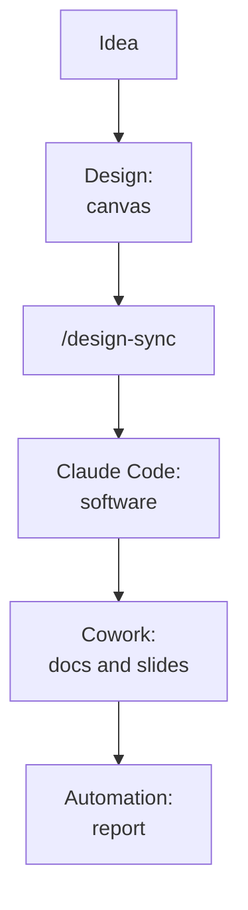

# Chapter C.1 — End-to-end project

> Closing — variable level.
> Synthesis concepts; product details from the ledger (verified 24/06/2026).

## Goal

This chapter runs through all the levels of the book on a real case: from an idea to
a small product, passing through Design, Claude Code, Cowork, and automation. It
introduces nothing new: it shows the pieces you've already seen working
**together**.

## The case (EVERGREEN)

Imagine you want to build a small internal app: a page where the team logs customer
requests and tracks their status. We'll take it from the idea all the way to a
report that updates on its own. Each stage points back to the chapter where you
learned it.

*Figure C.1.1 — The complete flow, from idea to automation.*
Alt text: vertical diagram connecting idea, Design, /design-sync, Code, Cowork, and
automation in sequence.

## 1. Idea and foundations (EVERGREEN)

You start from chat (Level 1). Describe the idea and get help bringing it into
focus: what the page should do, for whom, with which fields. The rule from ch. L1.2
applies — purpose, audience, format — and so does the one from ch. L1.1: the first
answer is a draft to refine. Out of this comes a short requirements document.

## 2. From design to code (EVERGREEN)

You open **Claude Design** (ch. L4.1) and generate the page on the canvas, starting
from your design system if you've imported it (ch. L4.2). You refine with chat,
comments, and direct edits. When the look holds up, you use `/design-sync` and the
**handoff** to **Claude Code** (ch. L4.3): the design becomes real software, without
rebuilding it from a screenshot.

In Claude Code you work on the real project, with `CLAUDE.md` and permissions
configured (ch. L2.4). For the delicate steps, a **hook** enforces the checks and a
**sub-agent** reviews the code before the commit (ch. L6.1). If the app needs to
read from one of your internal tools, you connect it via **MCP** (ch. L6.2).

## 3. Documents and organization (EVERGREEN)

With the app up and running, you need supporting material: a usage guide, a
presentation for the team. Here **Cowork** comes in (ch. L3.1): you connect the
project folder and hand it the work as an **end-state** — "from these files,
generate a `.docx` guide and a `.pptx` presentation." The methods from Level 3
apply: content first, then the file (ch. L3.4), and structure→content→style for the
slides (ch. L3.5).

A project **skill** (Level 5) holds the rules together — voice, structure, file
names — so the output is consistent every time (ch. L5.3).

## 4. Automation (EVERGREEN)

Finally, the report that updates on its own. With a **Scheduled Task** in Cowork
(ch. L6.3) you have Claude reread the requests every Friday and produce a summary. If you need it independent of your machine, you use a cloud **Routine**;
if you want to kick it off from outside, **Dispatch** from your phone. And if the
app grows to the point of needing a real integration, you move to the **API** (ch.
L6.6).

Throughout the journey you keep an eye on the **usage limits** (ch. L6.4): Projects
for context, clean sessions, tools on only when they're needed.

## What it demonstrates (EVERGREEN)

The value isn't in the individual tool, but in the handoff: Design passes to Code,
Code works with Cowork on the same folder, a skill makes it all repeatable,
automation closes the loop. It's the difference, seen all the way back in ch. F.2,
between a sum of tools and an ecosystem.

## In practice: try a mini-project

1. In chat, bring a small, concrete idea into focus (ch. L1.2).
2. Generate the interface in Design and hand it off to Code (ch. L4.3).
3. Configure the project in Claude Code (ch. L2.4).
4. In Cowork, generate a guide and slides from the folder (ch. L3.4, L3.5).
5. Add an automation for the recurring report (ch. L6.3).

## Summary

1. A real project runs through all the levels: chat, Design, Code, Cowork,
   automation.
2. **Design → /design-sync → Code** takes the interface to software without
   rebuilding it.
3. **Cowork** produces documents and slides from the project's own folder.
4. A **skill** makes the output consistent; **automation** keeps it up to date.
5. The value is in the handoff between the products, not in the individual tool.

## Next step

In **ch. C.2 — Appendices** you'll find the glossary, a troubleshooting table, and
the official links, to consult when you need them.

---

*Synthesis chapter: it recalls the products covered in Levels 1-6. No command run
here; the cross-references point to the chapters where each step is explained.*
