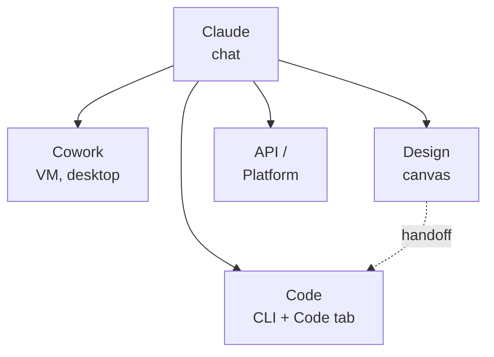

# F.2 — The Claude ecosystem

> Front matter — Level 0.
> Product details verified on 02/07/2026 against official sources.

## Goal

By the end you will have a mental map of the Claude products: what each one
does, where it runs and when it's worth using over the others. It's the compass
that orients the rest of the book.

## One intelligence, many doors (EVERGREEN)

Beneath the various products is the same engine: the Claude models. What changes
is how we access it and what we can have it do. The chat is the main door; the
other doors add autonomy (Cowork), code integration (Code), visual work
(Design) or programmatic control (API).

*Figure F.2.1 — The main doors to Claude.*
Alt text: vertical diagram with the chat at the top branching into Code, Cowork,
Design and API; from Design a handoff goes toward Code.

## The products, one by one (VOLATILE)

**Claude (chat).** The conversational assistant on web, desktop and mobile
apps. It's the starting point for questions, writing, analysis and file
generation. Available on all plans.

**Claude Code.** The agentic coding tool. It lives as a terminal command (CLI)
and as the **Code** tab in the desktop app, on the same engine. It's for those
who develop software. Requires a paid plan.

**Claude Cowork.** Brings agentic capabilities into the desktop app for
non-programming work: research, documents, file organization. It runs in an
isolated VM (a virtual machine separate from your system) and touches only the
folders you connect. Desktop only (macOS/Windows), paid plans.

**Claude Design.** A canvas for creating UI, prototypes and presentations by
conversing with Claude. It integrates with Code: when a design is ready, you
"hand it off" to development instead of starting over from a screenshot. Beta,
paid.

**Claude API / Developer Platform.** Programmatic access to the models, with SDK
and Console. It's for those who integrate Claude into their own software. It's
pay-as-you-go.

**Add-in and browser.** Claude also lives inside Excel/Word/PowerPoint (beta)
and as a Chrome extension that acts on web pages (beta, paid).

**The newest arrivals (beta).** The ecosystem keeps growing. **@Claude (Claude
Tag)** brings Claude into Slack as a team member: anyone in the channel can tag
it and delegate a task to it (Team/Enterprise). **Claude Science** is a
workbench for scientific research, with dozens of integrated databases and
toolkits; it's also the first desktop product available on Linux as well as
macOS (paid plans). Both are in beta: expect changes.

## When to use what (EVERGREEN)

The right question is not "which product is best", but "which is best suited to
this task". The table summarizes the choice.

Table F.2.1 — Product, where it runs, when it's worth it.

| Product | Where it runs | When to use it |
|---|---|---|
| Chat | web/desktop/mobile | questions, writing, analysis |
| Code | terminal + desktop | software development |
| Cowork | desktop (VM) | long tasks on your files |
| Design | web/desktop | UI, prototypes, slides |
| API | server/code | integrating Claude into your software |

> **Note:** chat, Cowork and Code coexist in the same desktop app as three tabs.
> Switching tabs means switching the way you work, not the application.

## How they talk to each other (EVERGREEN)

The real value emerges when the products hand work off to one another. From
Design you "hand off" an interface to Code, which actually builds it instead of
starting from scratch. Cowork and Code share the same project folder and the
same instructions. A Skill written once (Level 5) guides Claude the same way in
the chat, in Cowork and in Code. Learning the individual products is useful;
learning to make them collaborate is what makes Claude an ecosystem and not a
sum of tools.

## Summary

1. Beneath everything are the same Claude models: what changes is the door.
2. The **chat** is the general starting point.
3. **Code** is for programming; **Cowork** for autonomous tasks on your files.
4. **Design** covers the visual side and hands work off to Code.
5. The **APIs** are for integrating Claude into your own software.

## Next step

In **ch. F.3 — Models and plans** we'll choose the right model and plan: which
differences really matter and what each subscription unlocks.
