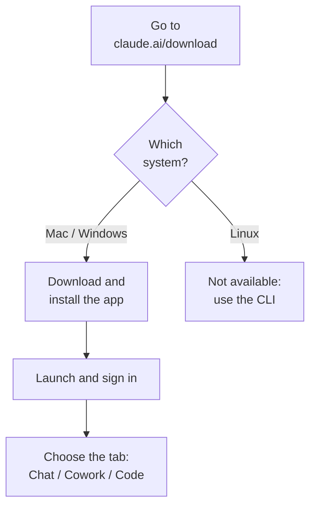

# Chapter L2.1 — Installing Claude Desktop

> Level 2 — Local installation.
> Product details verified on 22/06/2026 against official sources.

## Goal

By the end you will have the Claude Desktop app installed on your computer, you
will know how to sign in, and you will understand what its three tabs are for:
Chat, Cowork and Code. Claude Desktop is the application that brings Claude
straight to the desktop, without going through the browser.

## Prerequisites

- A Claude account (see ch. F.3). For **Chat** alone, signing in is enough;
  for **Cowork** you need a paid plan. (VOLATILE)
- A **macOS or Windows** computer. There is no Linux app: you use the CLI
  instead (see ch. L2.2). (VOLATILE)
- An active internet connection.

## System requirements (VOLATILE)

The app runs on recent systems. On Mac a single build covers both Intel and
Apple Silicon processors; on Windows there is a separate version for ARM64.

Table L2.1.1 — Supported systems.

| System | Minimum version | Notes |
|---|---|---|
| macOS | 11 (Big Sur) | Universal build |
| Windows | 10 | x64; ARM64 separate |
| Linux | — | none: use the CLI |

## Download and install (VOLATILE)

The path is the same for everyone: a download page, a file to open, a sign-in.
Figure L2.1.1 sums up the flow, including the Linux case.

*Figure L2.1.1 — Claude Desktop installation flow.*
Alt text: vertical diagram from download to choosing the tab.

> **Note:** the download page detects your system, but you can always pick the
> macOS or Windows version manually.

## The app's three tabs (EVERGREEN)

Once you are in, the app is split into three areas. It helps to know right away
which one does what, so you don't go looking for a feature in the wrong place.

Table L2.1.2 — What each tab is for.

| Tab | What it is for |
|---|---|
| Chat | conversations with Claude |
| Cowork | long agentic tasks and Dispatch |
| Code | software development in-app |

Chat is the starting point. Cowork hands Claude multi-step work on a folder on
your computer (we cover it in Level 3); **Dispatch** also starts here (sending a
task off so it continues remotely, picked up again in Level 6). Code brings the
CLI's capabilities into the app (Level 2 onward).

## In practice: install and sign in

1. Open **claude.ai/download** and choose macOS or Windows.
2. **Open the file** you downloaded to complete the installation.
3. Launch Claude from **Applications** (Mac) or the **Start menu** (Windows).
4. **Sign in** with your account.
5. Open the tabs and try Chat with a first message.

> **Tip (Windows + Code):** the first time you open the **Code** tab on Windows
> you need **Git for Windows** installed. Install it and **restart** the app.

## Cowork: what to know first (VOLATILE)

Cowork is included in the paid plans (Pro, Max, Team, Enterprise) and runs in
an **isolated VM** (virtual machine) on your computer. It reads and writes only
in the folders you connect, and the network follows your egress (outbound
traffic) settings. On Windows you have to enable the **Virtual Machine
Platform**.

## Common mistakes

- **I'm on Linux and can't find the app.** Correct: it doesn't exist. Use the
  CLI (ch. L2.2).
- **Windows ARM PC.** Download the dedicated **ARM64 installer**, not the x64.
- **Cowork won't start (Windows).** Check the paid plan and that the **Virtual
  Machine Platform** is enabled.
- **The Code tab errors on first launch (Windows).** Git for Windows is
  missing: install it and restart the app.

## Summary

1. Claude Desktop is available on **macOS 11+** and **Windows 10+**, not on
   Linux.
2. You install it from **claude.ai/download**: download, open, sign in.
3. The app has three tabs: **Chat**, **Cowork**, **Code**.
4. **Cowork** requires a paid plan and runs in an isolated VM.
5. On Windows, the **Code** tab requires **Git for Windows** on first launch.

## Next step

In **ch. L2.2 — Installing Claude Code** we look at the command-line version
(CLI), useful on Linux and for anyone automating, and the installation methods
along with their upkeep.

---

*Details verified on 22/06/2026 on support.claude.com (Install Claude Desktop)
and code.claude.com/docs/en/desktop. The installation is graphical and tied to
the account, so it was not run in the VM; the steps are reported faithfully from
the official documentation.*
