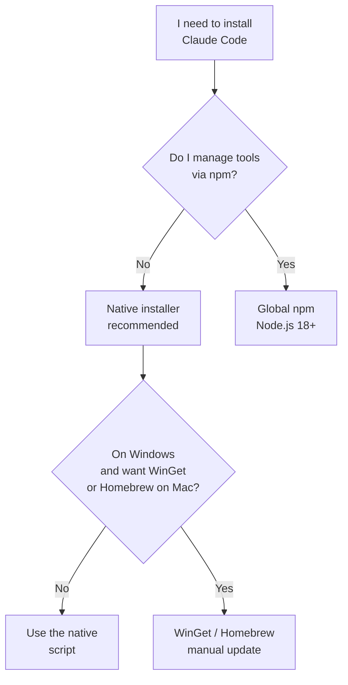

# Chapter L2.2 — Installing Claude Code

> Level 2 — Local installation.
> Product details verified on 21/06/2026 against official sources.

## Goal

By the end you will have Claude Code installed on your computer, you will know
how to choose the right method for your operating system, and you will have
verified that it works. Claude Code is the command-line tool (CLI) that works
directly on your project's files.

## Prerequisites

- A paid account: **Pro, Max, Team, Enterprise or Console (API)**.
  The Free plan does not include Claude Code (see ch. F.3 and the ledger). (VOLATILE)
- An open terminal. If you have never used one, see ch. L2.1.
- An active internet connection.

## Which method to choose (EVERGREEN)

There are several ways to install, but for almost everyone the choice is
simple: the **native installer**. It doesn't require Node.js and updates itself
in the background. The other methods are for specific cases.

*Figure L2.2.1 — Decision tree for the installation method.*
Alt text: vertical diagram guiding you through choosing the method.



> **Note:** native installer, Homebrew, WinGet and npm all install **the same
> binary**. All that changes is how it arrives and how it updates.

## Installing with the native installer (recommended)

Open the terminal and run the command for your system. (VOLATILE)

**macOS, Linux, WSL**

```bash
curl -fsSL https://claude.ai/install.sh | bash
```

**Windows — PowerShell**

```powershell
irm https://claude.ai/install.ps1 | iex
```

**Windows — CMD**

The command goes on **a single line**; here it is split with `^` for printing.

```bat
curl -fsSL https://claude.ai/install.cmd ^
  -o install.cmd && install.cmd ^
  && del install.cmd
```

> **Warning (Windows):** if you see the error *"The token '&&' is not a valid
> statement separator"* you are in PowerShell, not CMD. The prompt shows
> `PS C:\` in PowerShell and `C:\` without `PS` in CMD.

On native Windows, **Git for Windows** is optional but recommended: it enables
the Bash tool. Without Git, Claude Code uses the PowerShell tool.

## Alternative methods (VOLATILE)

Table L2.2.1 — When to use a different method.

| Method | Command | Update |
|---|---|---|
| Homebrew (mac) | `brew install --cask claude-code` | manual |
| WinGet (Win) | `winget install Anthropic.ClaudeCode` | manual |
| npm | `npm install -g @anthropic-ai/claude-code` | manual |

npm needs **Node.js 18+**. Golden rule: **never** `sudo npm install -g`,
because it creates permission problems and security risks. To update, use
`npm install -g @anthropic-ai/claude-code@latest`, not `npm update -g`.

On Debian/Ubuntu, Fedora/RHEL and Alpine there are also signed repositories
(apt, dnf, apk) on `downloads.claude.ai`: useful in enterprises, they update
with the normal system package manager.

## In practice: install and verify

1. Run the native installer command for your system.
2. **Open a new terminal** (to reload the PATH).
3. Check the version:

   ```bash
   claude --version
   ```

4. Run the installation and configuration diagnostics:

   ```bash
   claude doctor
   ```

5. Go into a **real project** folder (not empty) and start it:

   ```bash
   claude
   ```

   On first launch the browser opens for login: follow the instructions.

## Common mistakes

- **`command not found` after installation.** Open a new terminal. The native
  binary sits in `~/.local/bin/claude`: make sure that folder is in the PATH.
- **Tab/login rejected.** Check that the account is paid: the Free plan
  doesn't include Claude Code.
- **Permission errors with npm.** Don't use `sudo`. Point the npm prefix to
  a folder of your own, or use nvm.
- **Git Bash not found (Windows).** Set the path in `settings.json`:

  ```json
  {
    "env": {
      "CLAUDE_CODE_GIT_BASH_PATH":
        "C:\\Program Files\\Git\\bin\\bash.exe"
    }
  }
  ```

## Summary

1. For almost everyone, the **native installer** is the right choice: no Node,
   auto-update.
2. Three different commands for macOS/Linux/WSL, PowerShell and CMD.
3. npm, Homebrew and WinGet install the same binary, but update manually.
4. You need a paid account; **never** `sudo` with npm.
5. Always verify with `claude --version` and `claude doctor`.

## Next step

In **ch. L2.3 — Authentication and controls** we complete the login, look at
using an API key in automated environments, and read the output of
`claude doctor` to solve the most common problems.

---

*Commands verified on code.claude.com/docs/en/setup on 21/06/2026.
Runnability in the VM: the installation scripts require a network connection to
claude.ai and an account, so they were not run here; the commands are reported
faithfully from the official documentation.*
