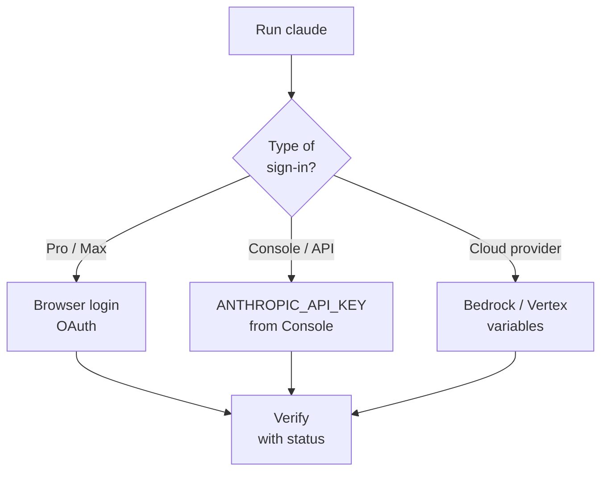

# Chapter L2.3 — Authentication and controls

> Level 2 — Local installation.
> Product details verified on 22/06/2026 against official sources.

## Goal

By the end you will know how to sign in to Claude Code with the right method —
subscription or API key — understand which credential is active, and diagnose
the most common login and PATH problems. This is the step that turns an
installation into a tool ready to use.

## Prerequisites

- Claude Code installed and working (see ch. L2.2). (VOLATILE)
- A paid account or an API key from Console (see ch. F.3). (VOLATILE)

## The first sign-in (VOLATILE)

After installation, go into a project folder and run:

```bash
claude
```

On first launch Claude Code opens the browser for login (OAuth, delegated
sign-in without typing the password in the terminal). Sign in with your
Claude.ai account and you return to the terminal already authenticated. If the
browser doesn't open on its own, press `c` to copy the URL and paste it
manually.

Depending on who you are, you sign in with a **Pro or Max** subscription
(Claude.ai account), a **Team/Enterprise** account invited by the administrator,
or **Claude Console** credentials if your organization bills via API.

> **Note:** to sign out and re-authenticate, type `/logout` at the Claude Code
> prompt; `/login` restarts the sign-in.

## Two paths: subscription or API key (EVERGREEN)

The two most common modes answer different needs. The **subscription** (browser
login) is the normal choice when you work at the computer. The **API key** is
for when there is no browser: servers, CI pipelines, automated scripts. There,
interactive login is not practical, and you use a key generated in the Console.

*Figure L2.3.1 — How to choose the sign-in method.*
Alt text: vertical diagram that goes from the claude command to three sign-in
paths and then to verification with status.



Table L2.3.1 — The authentication methods.

| Method | For whom | How |
|---|---|---|
| OAuth | use at the computer | browser login |
| API key | headless / CI | ANTHROPIC_API_KEY |
| Cloud | Bedrock/Vertex | dedicated variables |

## Using a headless API key (VOLATILE)

Generate the key in the Console (platform.claude.com) and set it as an
environment variable. On macOS and Linux:

```bash
export ANTHROPIC_API_KEY=sk-ant-...
```

On Windows (PowerShell):

```powershell
$env:ANTHROPIC_API_KEY = "sk-ant-..."
```

In interactive mode, Claude Code asks you once to approve the key and remembers
the choice. In non-interactive mode (`claude -p`) the key is always used,
without asking: that is what you need in scripts.

## Which credential wins (EVERGREEN)

If multiple credentials are present, Claude Code picks one in a fixed order,
from strongest to weakest:

1. cloud provider (`CLAUDE_CODE_USE_BEDROCK` and similar);
2. `ANTHROPIC_AUTH_TOKEN` (bearer for gateways or proxies);
3. `ANTHROPIC_API_KEY`;
4. `apiKeyHelper` script (rotating credentials);
5. OAuth subscription from `/login`.

Knowing the order explains the most frequent trap: if you have an active
subscription **but** also `ANTHROPIC_API_KEY` set, the key wins. If that key
belongs to a disabled organization, the login fails even though you have a valid
subscription.

> **Warning:** these variables only apply to the CLI in the terminal. Claude
> Desktop and remote sessions always use OAuth and ignore `ANTHROPIC_API_KEY`.

## Where the credentials end up (VOLATILE)

Claude Code stores the login securely: on macOS in the encrypted **Keychain**;
on Linux and Windows in the file `~/.claude/.credentials.json` (on Linux with
`0600` permissions), or under `$CLAUDE_CONFIG_DIR` if set. You don't have to
manage it by hand, but knowing where it is helps for backup or reset.

## In practice: sign in and verify

1. Go into a project folder and run `claude`.
2. Complete the login in the browser (or press `c` to copy the URL).
3. Check which method is active with `/status`.
4. If you need the installation diagnostics:

   ```bash
   claude doctor
   ```

5. In an automated environment set `ANTHROPIC_API_KEY` and start with
   `claude -p`.

## Common mistakes

- **Login failed with a valid subscription.** Likely an extra
  `ANTHROPIC_API_KEY`: run `unset ANTHROPIC_API_KEY` and re-check with
  `/status`.
- **`command not found` after installation.** Open a new terminal; the binary
  is in `~/.local/bin/claude`, which must be in the PATH (see ch. L2.2).
- **The browser doesn't open at login.** Press `c` to copy the URL and open it
  manually.
- **API key ignored in the Desktop.** That's normal: the Desktop uses only
  OAuth.

## Summary

1. On the first `claude` you sign in from the **browser** with your Claude.ai
   account.
2. For **headless** environments you use `ANTHROPIC_API_KEY` from the Console.
3. With multiple credentials a **fixed order** wins: the API key beats the
   subscription.
4. `/status` tells you which method is active; `/logout` clears the sign-in.
5. `claude doctor` diagnoses installation and configuration.

## Next step

In **ch. L2.4 — Configuring the project** we prepare `CLAUDE.md`, the `.claude`
folder and the permissions, to start Claude Code already "on the ball" on a real
repo.

---

*Details verified on 22/06/2026 on code.claude.com/docs/en/authentication and
support.claude.com (troubleshoot Claude Code). OAuth login and API key require
a real account, so they were not run in the VM; commands and variables are
reported faithfully from the official documentation.*
