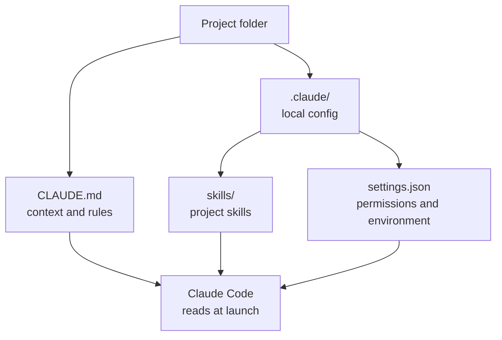

# Chapter L2.4 — Configuring the project

> Level 2 — Local installation.
> Stable concepts; product details verified against official sources.

## Goal

By the end you will know how to prepare a project folder so Claude Code works
well in it: writing a `CLAUDE.md` file that gives the context, understanding
what the `.claude/` folder is for, and setting permissions so Claude acts
without asking you for confirmation at every step, but not behind your back
either.

## Prerequisites

- Claude Code installed and working (see ch. L2.2).
- Login completed (see ch. L2.3).
- A **real** project folder: code, documents, anything you want to work on.
  Claude Code performs better on a real project than on an empty folder.

## Why configuring matters (EVERGREEN)

Claude Code starts out knowing nothing about your project. Every time you open a
session, it rebuilds the context by reading the files. You can explain
everything by voice at every launch, or write it once in a file it reads on its
own. The second path is the one that pays off: fewer repetitions, more
predictable behavior, and the same rules apply to anyone who opens the project.

Three elements make up the configuration: the `CLAUDE.md` file (the context),
the `.claude/` folder (skills, commands, local settings) and the permissions
(what Claude can do without asking).

*Figure L2.4.1 — What Claude Code reads at launch in a project folder.*
Alt text: vertical diagram showing the project folder with CLAUDE.md and the
.claude subfolder and their role.



## The CLAUDE.md file (EVERGREEN)

`CLAUDE.md` is a text file in Markdown format that you put in the project root.
Claude Code reads it at every launch and treats its content as instructions to
follow. It's the right place for the things you don't want to repeat:

- **What the project is:** a sentence or two on purpose and structure.
- **Commands you use often:** how to start it, how to test it, how to build it.
- **Conventions:** code style, names, things not to touch.
- **Constraints:** "don't modify folder X", "comments in English".

The rule is: little and useful. A huge `CLAUDE.md` gets diluted; a focused one
counts on every reply. Write the instructions the way you would tell them to
someone new on the team on their first day.

> **Tip:** inside Claude Code, the `/init` command analyzes the project and
> proposes a first `CLAUDE.md`. It's a good starting point to refine by hand,
> not a finished result. (VOLATILE)

A minimal example:

```markdown
# Project: orders API

Node.js app. Start: `npm run dev`.
Test: `npm test`. Don't modify `db/migrations/`.
Code comments in English.
```

## The .claude/ folder (EVERGREEN)

Alongside `CLAUDE.md` you can have a `.claude/` folder. It gathers the project's
local configuration:

- `.claude/skills/` — the skills specific to this project (see Level 5).
- `.claude/settings.json` — the project's permissions and environment variables.

The advantage is that this configuration lives **inside** the project: if it's
in a git repository, you share it with the team and version it like the rest.
Whoever clones the project inherits the same rules.

## Permissions: the happy medium (EVERGREEN)

Claude Code asks for confirmation before actions that change something: modifying
a file, running a command. It's a safeguard, but confirming everything slows you
down. Permissions are there to say in advance "these things you can do without
asking, these never".

You set them in `.claude/settings.json`. The basic schema distinguishes what is
always permitted (`allow`) from what is always denied (`deny`):

```json
{
  "permissions": {
    "allow": ["Bash(npm test)"],
    "deny": ["Bash(rm -rf *)"]
  }
}
```

The philosophy: grant the repetitive and safe actions (running tests, reading
files), keep confirmation for those that move or delete. Don't open everything
"for convenience": the point of the confirmation step is that you remain the
last word on the actions that matter.

## In practice: prepare a folder

1. Open the terminal and go into your project:

   ```bash
   cd ~/projects/my-app
   ```

2. Start Claude Code:

   ```bash
   claude
   ```

3. Generate a context draft:

   ```text
   /init
   ```

4. Open `CLAUDE.md`, cut the superfluous, add the commands you use and the
   things not to touch.
5. If you have rules about recurring commands, create `.claude/settings.json`
   with the `allow`/`deny` permissions.
6. If the project is in git, make a commit: now the configuration travels with
   the code.

## Common mistakes

- **CLAUDE.md too long.** It becomes noise. Keep only what changes behavior:
  purpose, commands, constraints.
- **Permissions too broad.** Putting everything in `allow` removes the safety
  net. Grant the repetitive and safe, not the destructive.
- **Configuration outside the repo.** If `.claude/` and `CLAUDE.md` aren't
  versioned, the team doesn't inherit them and the rules apply only to you.
- **Starting from an empty folder.** Claude Code gives its best on a real
  project. To learn, use a repo you already know.

## Summary

1. `CLAUDE.md` is the context Claude Code reads at every launch: purpose,
   commands, conventions, constraints.
2. Keep it short and focused: little and useful beats long and generic.
3. The `.claude/` folder gathers the project's local skills and settings.
4. Permissions (`allow`/`deny`) balance speed and control: grant the safe,
   confirm the destructive.
5. Version `CLAUDE.md` and `.claude/` in the repo: that way the rules apply to
   everyone.

## Next step

With the local installation complete, **Level 3 — Daily work** gets into
everyday use. We start with **ch. L3.1 — Cowork: first steps**, where you
delegate a task on a folder to Claude and learn to approve its actions.

---

*Concepts (CLAUDE.md, permissions, project structure) verified on
code.claude.com/docs on 24/06/2026. The `/init` command and starting `claude`
require an active account and were not run here.*
