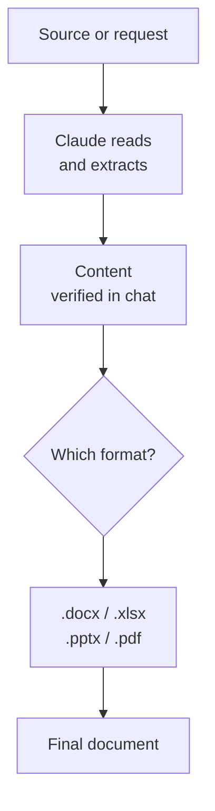

# Chapter L3.4 — Documents (Word, PowerPoint, Excel, PDF)

> Level 3 — Daily work.
> Product details verified on 22/06/2026 against official sources.

## Goal

By the end you'll know how to have Claude generate professional documents —
Word, Excel, PowerPoint, PDF — by asking for them the right way, applying the
"content first, then the file" principle, and starting from a template when you
want a repeatable result.

## Prerequisites

- Knowing how to write clear requests (see ch. L1.2).
- Having **Code execution / file creation** active (see ch. L1.3): it's the
  sandbox Claude uses to create files. It's on every plan. (VOLATILE)

## How Claude creates files (VOLATILE)

Claude doesn't "hand-write" a .docx: it uses a code execution sandbox that
generates the actual file, with the formatting needed. That's why the documents
produced are real files — openable in Word, Excel, PowerPoint — not plain pasted
text. The per-file limit is around **30 MB**. (VOLATILE)

The typical formats: **.docx** (Word), **.xlsx** (Excel), **.pptx**
(PowerPoint), **.pdf**. The rule for choosing is the recipient: a report to be
reread and edited is a .docx; data and calculations are an .xlsx; something to
present is a .pptx; a final document to distribute as is is a .pdf.

## Asking well (EVERGREEN)

A document is only as good as the request. Three things raise the quality of the
result:

- **The recipient and the purpose:** "a note for the board", "a flyer for
  customers". It changes tone, length, structure.
- **The structure you want:** the sections, the order, what to highlight.
- **The final format:** explicitly say .docx, .xlsx, .pptx or .pdf.

Compare:

- **Weak:** "Make me a document about sales."
- **Better:** "Create a one-page .docx report on Q1 sales for management: an
  opening summary, a table by region, three comment points. Sober tone."

## Content first, then the file (EVERGREEN)

The principle that makes the difference is "**read before create**": first the
content is settled, then it's laid out. A document starts badly if you ask at
the same time "find the data and make me the PDF": the risk is a nice layout on
wrong content.

It pays to separate the two moments:

1. **Content.** Have Claude produce or verify the data, the text, the numbers.
   Check them in chat.
2. **Document.** Only when the content is right, ask to put it into the file with
   the desired formatting.

If you start from an existing file — a report to summarize, data to rework — the
same holds: first Claude **reads** the source and extracts what's needed, then
builds the new document. Laying out first means redoing the work.

*Figure L3.4.1 — The "content first, then the file" flow.*
Alt text: vertical diagram from verified content to format choice to the final
document.



## Starting from a template (EVERGREEN)

If you produce the same kind of document often — a monthly report, a proposal —
don't start from scratch every time. Give Claude a **template**: a sample file
already set up, or a precise description of the structure. It pours the new
content into it, keeping form and style.

It's the natural bridge to Projects (ch. L3.2): put the template in the
knowledge base and every document comes out consistent with the previous one.
For voice and recurring style rules, Skills (Level 5) make all of this even more
repeatable.

## In practice: a report in two moments

1. In chat, have the content prepared and **check it**:

   ```text
   From the data I'm pasting, write the summary and
   the table by region. Show them to me, don't make
   the file yet.
   ```

2. Fix what's needed until the content is right.
3. Ask for the document, with format and structure:

   ```text
   Now put it in a one-page .docx: title,
   summary, table, three comment points.
   ```

4. Open the file and check. For touch-ups, ask for targeted edits instead of
   regenerating everything.

## Common mistakes

- **Asking for data and layout together.** Separate them: first the right
  content, then the file.
- **Not stating the format.** Without ".docx" or ".xlsx" you risk a generic
  output. Be explicit.
- **Regenerating for every touch-up.** Ask for targeted edits ("change only the
  table"): faster and safer.
- **Forgetting the sandbox.** If file creation doesn't start, check that Code
  execution is active (ch. L1.3). (VOLATILE)

## Summary

1. Claude generates real files (.docx, .xlsx, .pptx, .pdf) through the code
   execution sandbox.
2. Choose the format based on the recipient: report, data, presentation, final
   document.
3. Ask well: recipient, structure, explicit format.
4. "Content first, then the file": verify the content in chat, then lay it out.
5. For recurring documents start from a template; with Projects it becomes
   repeatable.

## Next step

In **ch. L3.5 — Slides and Excel** we get into the two most requested cases:
building a presentation and a spreadsheet with a method that avoids redoing the
work, and using the add-in inside Office.

---

*Data on Code execution / file creation (plans, ~30 MB limit) from the ledger,
verified on 22/06/2026 on support.claude.com. The examples were not executed
here.*
