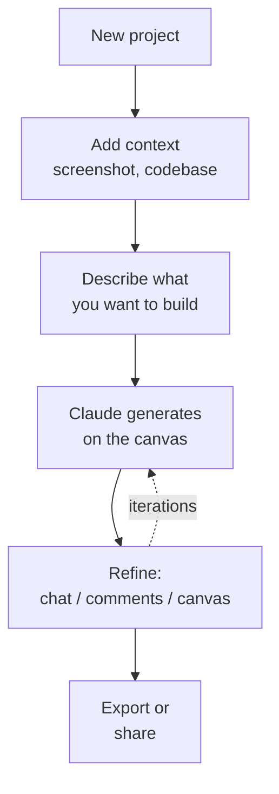

# Chapter L4.1 — Design: the canvas

> Level 4 — Design.
> Product details verified on 24/06/2026 against official sources.

## Goal

By the end you'll know what Claude Design is, how to generate your first project
on the canvas by conversing, and how to refine it in the three ways the product
offers: from chat, with inline comments and by editing directly on the canvas.
You'll also learn to ask for variants and to save a direction before trying
another.

## Prerequisites

- Knowing how to write effective requests (ch. L1.2): they apply identically
  here.
- A paid plan: **Pro, Max, Team or Enterprise**. Design is in beta and on
  Enterprise it's **off by default** (an admin enables it). (VOLATILE)

## What Claude Design is (VOLATILE)

Claude Design is the tool for creating interfaces, interactive prototypes and
presentations by **conversing** with Claude, instead of drawing by hand. You use
it on the web (claude.ai/design) or from the desktop app's sidebar; it's not on
mobile.

The screen has two areas: the **chat on the left**, where you describe what you
want, and the **canvas** on the right, where Claude generates the design. From
there you iterate: refine by conversing, leave comments on specific points, or
step in by hand on the canvas. It's the same principle as chat — describe the
result, then correct it — applied to a visual output.

## The workflow (EVERGREEN)

A Design project almost always follows the same path.

*Figure L4.1.1 — The flow of a project in Claude Design.*
Alt text: vertical diagram from the new project to the description, to
generation on the canvas, to refinement, to export.



The project automatically inherits your organization's design system, if
configured (we'll see this in ch. L4.2): colors, fonts and components are
already in the right place, without uploading anything.

## Writing a good prompt (EVERGREEN)

You don't need to be a designer. You need to be specific. A good prompt states
four things:

- **Goal:** what you're building.
- **Layout:** how to arrange the elements.
- **Content:** what information to show.
- **Audience:** who will use it.

For example: "Create a dashboard that shows monthly revenue, with filters by
region and product line." If something important is missing, Claude asks
questions before generating.

## Three ways to refine (EVERGREEN)

The first generation is a starting point. The real value is in the iteration,
and the product offers three routes — using them at the right moment saves time.

Table L4.1.1 — Which tool for which change.

| Tool | For what | Example |
|---|---|---|
| Chat | broad, structural changes | "darker theme" |
| Inline comments | targeted, on a component | "wider padding" |
| Direct editing | quick visual touch-ups | drag, resize |

**Chat** is for changes that affect the whole or need an explanation
("reorganize the dashboard", "add a panel on the right"). **Inline comments** are
applied by clicking directly on the element: faster than describing in words where
it is. **Direct editing** on the canvas is for moving, resizing and aligning on
the fly.

> **Warning:** sometimes an inline comment disappears before Claude reads it.
> It's a known issue: if the edit isn't picked up, paste the same feedback into
> chat. (VOLATILE)

## Variants and versions (EVERGREEN)

Two useful moves for when you haven't settled on a direction yet. To explore
alternatives, ask: "Show me 2-3 different layouts for this page" — comparing is
faster than guessing. To change course without losing the work done, tell Claude:
"Save what we have and try a completely different approach." Claude keeps the
current version and confirms where it saved it, so you can come back to it.

## In practice: your first project

1. Open **claude.ai/design** or the Design sidebar in the app, and create a
   project.
2. Add context if you have any: a reference screenshot, a codebase.
3. Write the prompt with **goal, layout, content, audience**:

   ```text
   Landing page for our new API product:
   hero, code examples, pricing section.
   Audience: developers.
   ```

4. Look at what it generates on the canvas.
5. Refine: chat for the big changes, comments for the details, freehand for the
   alignments.
6. Ask for 2-3 layout variants and choose from there.

## Common mistakes

- **Vague prompt.** "Make me a site" produces generic results. State goal,
  layout, content, audience.
- **Everything from chat.** To move an element or change a padding, inline
  comments and direct editing are faster.
- **Feedback not picked up.** If an inline comment disappears, paste it into
  chat. (VOLATILE)
- **Looking for Design on mobile.** It's web and desktop only. (VOLATILE)

## Summary

1. Claude Design creates UI, prototypes and slides by **conversing**; chat on
   the left, canvas on the right. Web and desktop only.
2. The flow: project → context → prompt → generation → refinement → export.
3. A good prompt states **goal, layout, content, audience**.
4. Refine with **chat** (broad changes), **inline comments** (targeted),
   **direct editing** (visual touch-ups).
5. Ask for **variants** and **save a version** before changing direction.

## Next step

In **ch. L4.2 — Design system import** we see how to make Design start from your
real brand: importing colors, fonts and components from a codebase or a deck,
and reducing the risk of an anonymous output.

---

*Data on Claude Design (areas, flow, refinement, beta/plans) verified on
24/06/2026 on support.claude.com/en/articles/14604416. The canvas requires a
paid account, so the steps were not executed here.*
