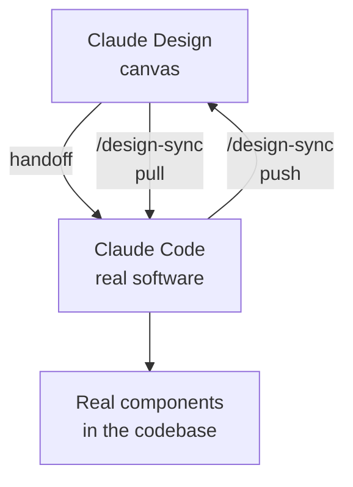

# Chapter L4.3 — From Design to code (/design-sync)

> Level 4 — Design.
> Product details verified on 24/06/2026 against official sources.

## Goal

By the end you'll understand the bridge between Claude Design and Claude Code:
how `/design-sync` connects canvas and code in both directions, how to pass a
design to Claude Code so it becomes real software without starting over from a
screenshot, and how to start a Design project directly from the terminal. It's
the chapter that makes Design and Code a single cycle instead of two separate
tools.

## Prerequisites

- Claude Code installed and configured (ch. L2.2, L2.4).
- Having used the canvas (ch. L4.1) and, ideally, imported a design system
  (ch. L4.2).

## The problem it solves (EVERGREEN)

The classic pain point of design→development work is the handoff jump: the
designer hands over a screenshot or a file, and whoever develops **rebuilds
everything from scratch**. Time and fidelity are lost. The bridge between Design
and Code removes this step: Claude Code continues from the existing work, not
from a photo of the result.

## The Design ↔ Code cycle (EVERGREEN)

Design and Code are not a one-way chain, but a loop. The design generates code;
the code, as it evolves, updates the design. `/design-sync` keeps the two sides
aligned.

*Figure L4.3.1 — The two-way cycle between Design and Code.*
Alt text: vertical diagram showing the canvas and the code connected by pull and
push, with the handoff toward Claude Code.



## /design-sync in both directions (VOLATILE)

The `/design-sync` command runs **inside Claude Code** and works in two
directions.

- **Pull (code → canvas):** imports your local codebase's design system into
  Claude Design, so every screen you generate starts from your real components.
- **Push (canvas → code):** after you've implemented a design in code,
  `/design-sync` sends the current state back into the canvas, keeping Design
  aligned with what you've actually built.

In practice: you start from the code to give Design the right foundations
(pull), build and iterate, then send the result back so that canvas and product
don't drift apart (push).

Table L4.3.1 — The two directions of `/design-sync`.

| Direction | From → To | What it's for |
|---|---|---|
| Pull | code → canvas | design on real components |
| Push | canvas → code | canvas aligned to the build |

## The handoff to Claude Code (VOLATILE)

When a design is ready to become software, you **hand it off** to Claude Code.
Code continues from the existing work instead of rebuilding it from a screenshot.
The handoff can also be started from Design's **Export** button (see ch. L4.5) and
can target the local coding agent or Claude Code Web.

## Starting from Claude Code: /design (VOLATILE)

If you prefer to stay in the terminal, you don't have to open the canvas at all.
With the `/design` command you start, edit and sync a Design project **without
leaving Claude Code**: import a design into the codebase, export the code as a
live prototype, or let Claude build everything from scratch.

> **Note:** if you don't see `/design` or `/design-sync` in Claude Code, run
> `/update` to update the skills. The commands appear only in **new sessions**,
> not in the one already open. (VOLATILE)

## In practice: from codebase to canvas and back

1. In Claude Code, inside your project, run:

   ```text
   /design-sync
   ```

2. Choose **pull**: you import the codebase's design system into Design.
3. In Design, generate and iterate on the screens: they'll use your real
   components.
4. When a screen is ready, do a **handoff** to Claude Code and build.
5. After the implementation, `/design-sync` again in **push** to realign the
   canvas to the code.

> **Tip:** if the commands don't appear, `/update` and then open a new session.

## Common mistakes

- **Expecting the commands in the current session.** After `/update`, `/design`
  and `/design-sync` are only in new sessions. (VOLATILE)
- **Handoff from a screenshot.** Not needed: the handoff brings the real work,
  not a photo. Pass the project, not an image.
- **Canvas and code diverging.** After building, remember the **push**: without
  it, Design falls behind the product.
- **Skipping the initial pull.** Without it, Design generates with the default
  style and not with your components.

## Summary

1. The Design↔Code bridge eliminates the "rebuild from screenshot".
2. `/design-sync` runs in Claude Code in two directions: **pull** (code→canvas)
   and **push** (canvas→code).
3. The **handoff** passes the design to Code, which continues from the real work.
4. With `/design` you start and sync a Design project **from the terminal**.
5. If the commands are missing, `/update` and open a **new session**.

## Next step

In **ch. L4.4 — Design inside Cowork** we see how to use Design's outputs as
material for agentic tasks, and how Skills make visual work repeatable.

---

*Data on `/design-sync`, handoff and `/design` verified on 24/06/2026 on
support.claude.com/en/articles/14604416. The commands require Claude Code with a
paid account, so they were not executed here.*
