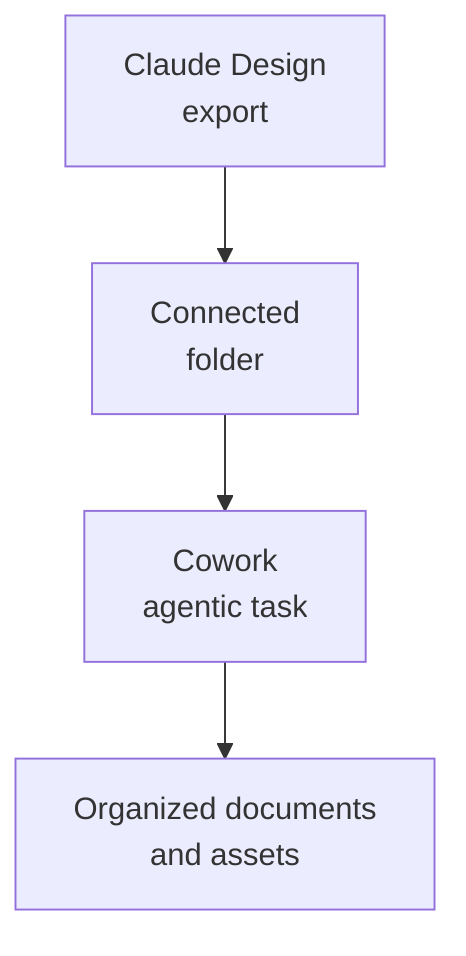

# Chapter L4.4 — Design inside Cowork

> Level 4 — Design.
> Concepts of composition between products; details verified on 24/06/2026.

## Goal

By the end you'll know how to use what you produce in Claude Design as **material**
for Cowork's agentic tasks, and you'll understand how Skills make visual work
repeatable instead of having to re-explain it every time. This is a chapter about
composition: not a new tool, but two you already know put to work together.

## Prerequisites

- Knowing how to start a task in Cowork (ch. L3.1).
- Having produced something in Design (ch. L4.1) and exported an output (ch. L4.5).

## Design produces, Cowork works (EVERGREEN)

Design and Cowork answer different needs. Design **creates** visual material:
screens, prototypes, slides, the code of a prototype. Cowork **acts** on a folder
of files across multiple steps. The point of contact is natural: Design's outputs
become Cowork's **inputs**.

The link runs through the folder. You export from Design (for example a ZIP, a
standalone HTML, or a prototype's code, see ch. L4.5), put it in a folder
connected to Cowork, and from there Cowork works on it: it reorganizes the assets,
generates the documentation, prepares the files for delivery. Remember that Cowork
sees **only the folders you connect** (ch. L3.1): an asset exists for it only
once you've put it there.

*Figure L4.4.1 — From Design's outputs to Cowork's tasks.*
Alt text: vertical diagram from the Design export to the connected folder to
Cowork's agentic task.

## Skills make design repeatable (EVERGREEN)

The real leap in quality isn't moving a file: it's making the way visual work is
handled **repeatable**. This is where Skills come in (Level 5): a skill writes the
rules once — how to name assets, what folder structure to use, what checks to run
on an export — and Claude applies them the same way in chat, in Cowork and in Code.

Without a skill, you repeat the instructions for every task ("put the assets in
`/img`, rename them like this, generate the index"). With a skill, you say them
once and they always hold. It's the difference between a result that depends on
how precise you were today and a result that's consistent every time.

## A concrete example (EVERGREEN)

Imagine producing the mockups of a new section of the site in Design and exporting
them as standalone HTML. The composed flow:

1. You export the mockups from Design into a project folder.
2. You connect the folder to Cowork.
3. You give Cowork a task as an **end-state** (ch. L3.1): "Organize these mockups
   by page, generate an `INDEX.md` with previews and notes, and prepare a
   `delivery/` folder ready to send."
4. A project skill ensures that names, structure and checks are always the same,
   mockup after mockup.

The result: Design does the creative part, Cowork the repetitive, organizational
part, and the skill holds the rules together.

## In practice: composing Design and Cowork

1. In Design, export the output you need (ch. L4.5) into a folder.
2. In Cowork, **connect** that folder.
3. Write the task as the desired result, not as a sequence of steps.
4. If you repeat the same kind of work, wrap the rules in a project **skill**
   (Level 5).
5. Re-run it on new assets: the skill keeps things consistent.

## Common mistakes

- **Expecting an automatic link.** Design doesn't "enter" Cowork by itself: you go
  through an export and a connected folder.
- **Forgetting to connect the folder.** Cowork sees only what you connect: if the
  asset isn't there, it doesn't exist as far as Cowork is concerned (ch. L3.1).
- **Repeating the rules for every task.** If the work recurs, put it in a skill
  instead of re-explaining it.
- **Guiding Cowork step by step.** It holds here too: describe the end-state.

## Summary

1. Design **creates** visual material; Cowork **acts** on the files: the outputs of
   the first are inputs to the second.
2. The link runs through an **export** into a **folder connected** to Cowork.
3. **Skills** make the handling of visual work repeatable, the same in chat, Cowork
   and Code.
4. Typical pattern: Design creates, Cowork organizes, the skill holds the rules.
5. In Cowork always describe the **result**, not the steps.

## Next step

In **ch. L4.5 — Export and Canva** we close Level 4 with Design's output formats —
PDF, PPTX, HTML, Canva and the others — and with the criterion for choosing between
exporting and doing a handoff.

---

*Chapter on composition between Design (ch. L4.1, L4.5) and Cowork (ch. L3.1). The
capabilities of Skills are introduced here and explored in depth at Level 5. No
command was executed here.*
