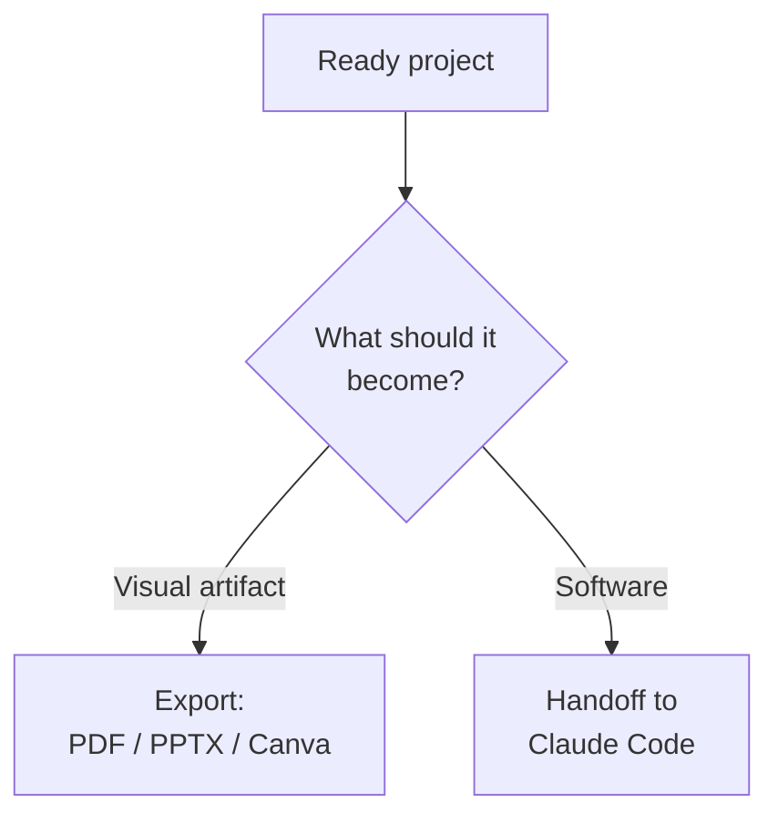

# Chapter L4.5 — Export and Canva

> Level 4 — Design.
> Product details verified on 24/06/2026 against official sources.

## Goal

By the end you'll know how to export a Claude Design project in the right format,
send it to the tools you already use (Canva and others), and choose sensibly
between **exporting** a file and doing a **handoff** to code. This is the chapter
that takes the work off the canvas.

## Prerequisites

- A project ready on the canvas (ch. L4.1).
- For the handoff, Claude Code installed (ch. L2.2) and the concept of the
  Design↔Code bridge (ch. L4.3).

## Where export lives (VOLATILE)

When the design is ready, the **Export** button at the top right opens the ways
out. The right format depends on what you need to do with it: gather feedback,
hand off to development, or present to a group.

## The output formats (VOLATILE)

The destinations group by purpose. The table sums up the main ones.

Table L4.5.1 — Export formats and when to use them.

| Purpose | Format | When |
|---|---|---|
| Review | PDF | feedback, print |
| Present | PPTX / Canva | slides to refine |
| Publish | HTML / ZIP | prototype, web |

Beyond these, Design exports as **.zip**, sends **to Canva** and produces
**standalone HTML**. It can also send the project to external tools — Adobe,
Base44, Canva, Gamma, Lovable, Miro, Replit, Vercel, Wix — with other destinations
on the way. For sharing within the organization there's a **link** with
three-level permissions: view only, comment, edit.

## Canva and the external tools (VOLATILE)

"Send to Canva" brings the design into Canva, where you refine it with layout
tools you already know. The same logic applies to the other destinations: Design
isn't trying to replace your tools, but to **hand them** a starting point already
set up on your brand, instead of making you start over from a blank page.

## Export or handoff? (EVERGREEN)

This is the choice that matters most, and it depends on where the work is headed.

- **Export** when the output is the goal: a PDF for an opinion, a PPTX to present,
  a Canva file to refine. The design stays a visual artifact.
- **Do a handoff** when the design has to become **software**. The handoff to
  Claude Code (ch. L4.3) continues from the real work, without rebuilding from a
  screenshot, and targets the local coding agent or Claude Code Web.

Rule of thumb: if the next person to touch it opens a viewer, export; if they open
a code editor, do a handoff.

*Figure L4.5.1 — Export or handoff: the fork.*
Alt text: vertical diagram that from the ready project separates the export branch
from the handoff branch toward code.

## In practice: take your design out

1. Open the project and press **Export** at the top right.
2. For an opinion: **PDF**. To present: **PPTX** or **Send to Canva**.
3. For a web prototype: **standalone HTML** or **.zip**.
4. If it has to become software, choose **Handoff to Claude Code** instead of a
   file.
5. To share with the team, generate a **link** with the right permission (view,
   comment or edit).

## Common mistakes

- **Exporting a screenshot for development.** If it becomes code, do a handoff: you
  carry the real work, not a photo.
- **Wrong format for the purpose.** PDF for an opinion, PPTX/Canva to present,
  HTML/ZIP for the web.
- **Link with too broad a permission.** For a simple opinion, "view only" or
  "comment" is enough, not "edit".
- **Looking for destinations that aren't there yet.** The list grows over time:
  check which are available at the moment. (VOLATILE)

## Summary

1. The **Export** button (top right) opens Design's ways out.
2. Formats: **PDF, PPTX, HTML, .zip**, sending to **Canva** and to other tools.
3. **Send to Canva** and the like hand over a starting point already on your brand.
4. **Export** for a visual artifact; **handoff** when it has to become software.
5. Share within the org with a **link** with permissions: view, comment, edit.

## Next step

You've completed Level 4. In **Level 5 — Skills and identity** we look at what
Skills really are — already met as the glue of Cowork and Design — starting from
**ch. L5.1 — Anatomy of a skill**.

---

*Data on export, destinations and sharing verified on 24/06/2026 on
support.claude.com/en/articles/14604416. The features require a paid account, so
they were not executed here.*
