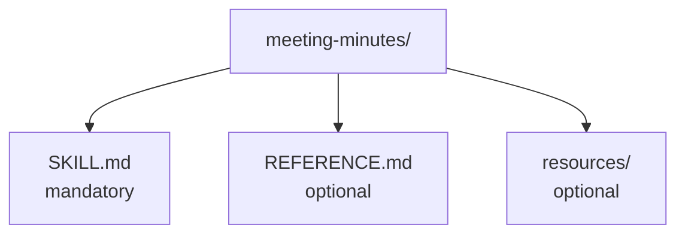

# Chapter L5.2 — Your first skill

> Level 5 — Skills and identity.
> Product details verified on 24/06/2026 against official sources.

## Goal

By the end you'll have created a working skill: the folder structure, a
`description` that "triggers" when it should, and a way to test it. We'll see both
the manual route and the help of **skill-creator**, the skill that assists you in
building others.

## Prerequisites

- Understanding the anatomy of a skill (ch. L5.1).
- **Code execution** active (ch. L1.3). (VOLATILE)

## The folder structure (VOLATILE)

A skill is a folder whose name matches the name of the skill, with at least the
`SKILL.md` file inside. If you add resources or scripts, they go in the same
folder.

*Figure L5.2.1 — Structure of a skill folder.*
Alt text: vertical diagram of the skill folder with SKILL.md and a resources
subfolder.

To use it in chat or in Cowork, the folder must be compressed into a **ZIP** with
the folder itself as the root (not the loose files in the ZIP), and then uploaded.
In Claude Code, on the other hand, you put it under the project's `.claude/skills/`
(ch. L2.4).

## Writing a description that triggers (EVERGREEN)

This is the step that decides everything. The `description` must say **what** the
skill does and **when** Claude should use it, in at most 200 characters. Two
examples side by side:

- **Weak:** "Helps with emails." — too generic, triggers randomly or never.
- **Strong:** "Writes polite, short email replies to customers, starting from the
  message received." — it states the task and the context of use.

The rule: include the signals you want to trigger the skill. If it should activate
on minutes, name minutes; if on customers, name customers.

## Building it with skill-creator (VOLATILE)

You aren't forced to start from a blank page. **skill-creator** is an official
skill that guides you in creating one: it sets up the structure, helps you write
the description and can generate test prompts (evals) to check that the skill
triggers when it should — and, importantly, that it does **not** trigger when it
shouldn't.

It's the quickest way to a solid first skill: you describe the workflow you want to
automate, and skill-creator produces the skeleton that you then refine.

## Testing before and after upload (EVERGREEN)

A skill is judged in the field. Before uploading it, re-read the `SKILL.md`, check
that the description really reflects when it's needed, and verify that the
referenced files exist. After uploading and enabling it in **Customize > Skills**,
try it with several prompts that should activate it, and check in Claude's
"thinking" that it's loading it. If it doesn't trigger when you expect, the thing
to fix is almost always the **description**.

## In practice: create and test a skill

1. Create a folder with the name of the skill (e.g. `meeting-minutes`).
2. Inside, write `SKILL.md` with frontmatter (name, description) and body.
3. Take care with the **description**: what it does and when to use it, under 200
   characters.
4. For chat/Cowork, compress the folder into a **ZIP** (folder as root) and upload
   it; enable it in **Customize > Skills**.
5. Try it with prompts that should activate it; check that it loads.
6. If it doesn't trigger, **iterate on the description** and try again.

## Common mistakes

- **ZIP with loose files.** The ZIP must contain the **folder** as root, not the
  files directly. (VOLATILE)
- **Folder name different from the skill name.** Make them match.
- **A description that doesn't trigger.** Add the "when" signals; don't describe
  only the "what".
- **Testing it only once.** Test with several prompts, including some that should
  **not** activate it.
- **Hardcoding secrets.** Never keys or passwords inside a skill. (EVERGREEN)

## Summary

1. A skill is a **folder** (name = skill name) with `SKILL.md` inside.
2. For chat/Cowork it's uploaded as a **ZIP** with the folder as root; in Code it
   goes in `.claude/skills/`.
3. The **description** that triggers names what it does **and** when to use it.
4. **skill-creator** scaffolds the skill and generates activation tests.
5. Test before and after upload; if it doesn't trigger, iterate on the description.

## Next step

In **ch. L5.3 — Skills in operation in Cowork** we look at Skills at work in
autonomous tasks: differences between chat and Cowork, how to split them, and team
sharing. We'll use as an example the three skills this book is written with.

---

*Data on structure, ZIP packaging, testing and skill-creator verified on
24/06/2026 on support.claude.com/en/articles/12512198. No skill was created or
executed here.*
