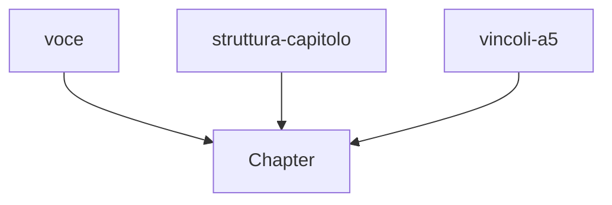

# Chapter L5.3 — Skills in operation in Cowork

> Level 5 — Skills and identity.
> Product details verified on 24/06/2026 against official sources.

## Goal

By the end you'll know how to use Skills in autonomous work: how they behave in
chat versus Cowork, why it's worth splitting them into several focused skills
instead of one big one, and how to share them in a team. The guiding example is the
three skills this book is written with.

## Prerequisites

- Knowing how to create a skill (ch. L5.2).
- Knowing Cowork (ch. L3.1).

## In chat and in Cowork (EVERGREEN)

The same skill is valid in chat, in Cowork and in Claude Code: you write it once
and it guides Claude the same way everywhere. What changes is the context it works
in.

In **chat** the skill refines a single response: tone, format, structure. In
**Cowork**, where Claude runs a long task on a folder across multiple steps, the
skill counts for more: it governs a behavior repeated over many files, without your
having to repeat the rules at every step. The more autonomous and long the work,
the more a well-written skill makes the difference between a consistent result and
one that depends on how precise you were today.

## Splitting instead of piling up (EVERGREEN)

The temptation is to write one skill that does everything. It's almost always a
mistake. Several **focused** skills compose better than a monolithic one, for two
reasons: the `description` of a targeted skill triggers precisely (ch. L5.1),
whereas that of a do-it-all skill is necessarily vague; and Claude can **combine**
several skills automatically when they're needed together.

Rule of thumb: one skill, one workflow. If you notice a skill has two distinct
purposes, split it. Skills can't call one another, but Claude uses several in the
same task: the composition is done by it.

## Example: the three skills of this book (EVERGREEN)

This manual is written with three separate skills instead of one big one:

- **voce** — tone and terminology: plain, direct prose, product terms in English,
  no brochure-style enthusiasm.
- **struttura-capitolo** — standard structure, length target, use of the facts
  ledger, definition of done.
- **vincoli-a5** — layout constraints: narrow code, three-column tables, vertical
  diagrams.

Each has a clear purpose and a description that triggers on its scope. When I write
a chapter, Claude uses **all three together**: voice governs the text, structure
the skeleton, constraints the form. A single skill that did the work of all three
would be harder to write, to trigger and to update.

*Figure L5.3.1 — Three focused skills that Claude composes on a chapter.*
Alt text: vertical diagram with three skills converging on the writing of a
chapter.

## Sharing in a team (VOLATILE)

A useful skill shouldn't stay on your account. On the **Team and Enterprise** plans
an administrator can provide and manage skills for the whole organization, so
everyone works with the same rules. It's the way to make a standard — of voice, of
format, of process — something that holds for the group and not just for whoever
wrote it. (VOLATILE)

> **Tip:** before sharing a skill in a team, have someone else try it on real
> prompts. A description that triggers well for you may trigger badly for someone
> who uses different words.

## In practice: bring your skills into Cowork

1. Start from a workflow you repeat often in Cowork (e.g. organizing assets,
   producing a report).
2. Write its rules in a **focused** skill (ch. L5.2).
3. If the purposes are two, make **two** skills, not one.
4. Activate it and launch a task in Cowork: verify that the rules are applied.
5. If you're in a team, ask the admin to make it available to the organization.

## Common mistakes

- **The do-it-all skill.** Vague description and hard to maintain. Split by
  workflow.
- **Expecting one skill to call another.** It doesn't happen: it's Claude that
  composes them. Write them self-contained.
- **Sharing without having it tested.** In a team, a description should be tested
  on several ways of writing the same intent.
- **Repeating the rules in the prompt.** If they're in a skill, there's no need to
  restate them in every task.

## Summary

1. The same skill is valid in chat, Cowork and Code; in Cowork it weighs more
   because it governs long, autonomous tasks.
2. Several **focused** skills compose better than a monolithic one.
3. Skills don't call one another: the **composition** is done by Claude.
4. The three skills of this book (voce, struttura, vincoli) are the example of the
   pattern.
5. In **Team/Enterprise** an admin shares the skills with the whole organization.

## Next step

In **ch. L5.4 — Making Claude sound like you** we put together all the identity
tools — instructions, Projects, context files and Skills — to give Claude your
voice in a stable way.

---

*Data on use, composition and sharing of skills verified on 24/06/2026 on
support.claude.com/en/articles/12512198. The example of the three skills is real
(they're the ones from this book's project). No skill executed here.*
