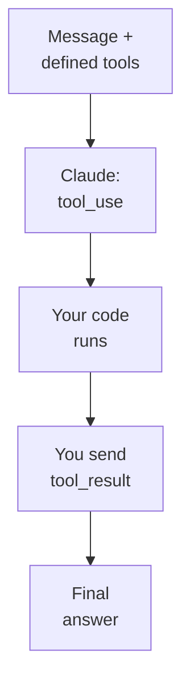

# Chapter L6.6 — Integrating via API

> Level 6 — Advanced.
> Product details verified on 24/06/2026 against official sources.

## Goal

By the end you'll know when to move to the API, what a call to the messages
endpoint looks like, and how **tool use** works. It's the bridge from someone who
*uses* Claude to someone who *integrates* it into their own software.

## Prerequisites

- An API key from the Console (ch. L2.3, F.3). (VOLATILE)
- Familiarity with a programming language.

## When you need the API (EVERGREEN)

The interfaces (chat, Cowork, Code) are enough for personal work. The **API** is
for when you want to put Claude **inside** a product of yours: an app that answers
customers, a process that classifies documents, a service that generates text on
demand. It's programmatic access, pay-as-you-go by token (ch. F.3).

## The messages endpoint (VOLATILE)

The heart of the API is one endpoint: you send a list of messages, Claude generates
the next one. The raw call, with `curl`:

```bash
curl https://api.anthropic.com/v1/messages \
  -H "x-api-key: $ANTHROPIC_API_KEY" \
  -H "anthropic-version: 2023-06-01" \
  -H "content-type: application/json" \
  -d '{
    "model": "claude-opus-4-8",
    "max_tokens": 1024,
    "messages": [
      {"role": "user",
       "content": "Hello"}
    ]
  }'
```

Three headers are mandatory: `x-api-key` (your key), `anthropic-version` (e.g.
`2023-06-01`), and `content-type`. The body declares at least `model`,
`max_tokens`, and `messages`. (VOLATILE: the model string changes, see the
ledger.)

## With the SDK (VOLATILE)

In practice you don't use `curl`, but an official SDK (Python or TypeScript), which
handles headers and formats. In Python:

```python
import anthropic

# Reads the key from ANTHROPIC_API_KEY
client = anthropic.Anthropic()

msg = client.messages.create(
    model="claude-opus-4-8",
    max_tokens=1024,
    messages=[
        {"role": "user",
         "content": "Hello, who are you?"},
    ],
)
print(msg.content[0].text)
```

## Tool use, in brief (EVERGREEN)

**Tool use** lets Claude use tools you provide — a function that queries a database,
calls an API, runs a calculation. The flow is a back-and-forth in three steps:

1. You define the tools in the request and send the message.
2. If a tool is needed, Claude responds with `stop_reason: "tool_use"` and a block
   that says **which** tool and with **which** arguments.
3. Your code runs the operation and returns the result as a `tool_result`; Claude
   uses it for the final answer.

*Figure L6.6.1 — The tool use cycle.*
Alt text: vertical diagram from the message to the tool request, to execution in
your code, to the result, to the final answer.



The key point: the tool **you run yourself**, in your software. Claude decides when
to use it and with which arguments, but the code stays under your control.

## In practice: your first call

1. Generate an **API key** in the Console and set it as an environment variable
   (ch. L2.3).
2. Install the SDK for your language (Python or TypeScript).
3. Make a minimal call to the messages endpoint and read the response.
4. To integrate actions, define a **tool** and handle the `tool_use` →
   `tool_result` cycle.
5. Keep the key out of the code: use environment variables (ch. L2.3).

## Common mistakes

- **Missing headers.** You need `x-api-key`, `anthropic-version`, and
  `content-type`. (VOLATILE)
- **Hardcoded model string.** It changes over time: take it from the ledger or the
  official sources.
- **Key in the code.** Never: use an environment variable (ch. L2.3).
- **Expecting Claude to run the tool.** You run it; Claude decides when and how to
  call it.

## Summary

1. The API is for integrating Claude **inside** your software; pay-as-you-go.
2. Endpoint `POST /v1/messages` with headers `x-api-key`, `anthropic-version`,
   `content-type`.
3. In practice you use an **SDK** (Python/TS), not `curl`.
4. **Tool use** is a cycle: Claude asks for a tool, your code runs it and returns
   the result.
5. The key lives in an **environment variable**, never in the code.

## Next step

You've completed Level 6. In the **Closing**, **ch. C.1 — End-to-end project** runs
through all the levels on a real case, from design to code to automation.

---

*Data on the endpoint, headers, and tool use verified on 24/06/2026 against
platform.claude.com/docs (messages, tool use). The examples were not run here; they
require a valid API key.*
