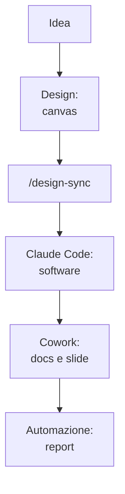

# Capitolo C.1 — Progetto end-to-end

> Chiusura — livello variabile.
> Concetti di sintesi; dettagli di prodotto dal ledger (verificati 24/06/2026).

## Obiettivo

Questo capitolo attraversa tutti i livelli del libro su un caso reale: da un'idea a
un piccolo prodotto, passando per Design, Claude Code, Cowork e l'automazione. Non
introduce nulla di nuovo: mostra i pezzi già visti che lavorano **insieme**.

## Il caso (EVERGREEN)

Immagina di voler costruire una piccola app interna: una pagina dove il team
registra le richieste dei clienti e ne segue lo stato. La porteremo dall'idea fino
a un report che si aggiorna da solo. Ogni tappa rimanda al capitolo dove l'hai
imparata.

*Figura C.1.1 — Il flusso completo, da idea a automazione.*
Alt-text: diagramma verticale che collega idea, Design, design-sync, Code, Cowork e
automazione in sequenza.

## 1. Idea e fondamenta (EVERGREEN)

Si parte dalla chat (Livello 1). Descrivi l'idea e fatti aiutare a metterla a
fuoco: cosa deve fare la pagina, per chi, con quali campi. Vale la regola del cap.
L1.2 — scopo, destinatario, formato — e quella del cap. L1.1: la prima risposta è
una bozza da affinare. Da qui esce un breve documento di requisiti.

## 2. Dal design al codice (EVERGREEN)

Apri **Claude Design** (cap. L4.1) e generi la pagina sul canvas, partendo dal tuo
design system se l'hai importato (cap. L4.2). Rifinisci con chat, commenti e
modifiche dirette. Quando l'aspetto regge, usi `/design-sync` e l'**handoff** verso
**Claude Code** (cap. L4.3): il design diventa software vero, senza ricostruirlo da
uno screenshot.

In Claude Code lavori sul progetto reale, con `CLAUDE.md` e i permessi configurati
(cap. L2.4). Per i passaggi delicati, un **hook** impone i controlli e un
**sub-agent** rivede il codice prima del commit (cap. L6.1). Se l'app deve leggere
da un tuo strumento interno, lo colleghi via **MCP** (cap. L6.2).

## 3. Documenti e organizzazione (EVERGREEN)

A app avviata, serve materiale di contorno: una guida d'uso, una presentazione per
il team. Qui entra **Cowork** (cap. L3.1): colleghi la cartella del progetto e gli
affidi il lavoro come **end-state** — «da questi file, genera una guida `.docx` e
una presentazione `.pptx`». Valgono i metodi del Livello 3: prima il contenuto, poi
il file (cap. L3.4), e struttura→contenuti→stile per le slide (cap. L3.5).

Una **skill** di progetto (Livello 5) tiene insieme le regole — voce, struttura,
nomi dei file — così l'output è coerente ogni volta (cap. L5.3).

## 4. Automazione (EVERGREEN)

Infine, il report che si aggiorna da solo. Con un **Scheduled Task** in Cowork (cap.
L6.3) fai sì che ogni venerdì Claude rilegga le richieste e produca un riepilogo. Se
ti serve indipendente dalla tua macchina, usi una **Routine** cloud; se vuoi farlo
partire da fuori, il **Dispatch** dal telefono. E se l'app cresce fino a richiedere
un'integrazione vera, passi alle **API** (cap. L6.6).

Lungo tutto il percorso tieni d'occhio i **limiti d'uso** (cap. L6.4): Project per
il contesto, sessioni pulite, tool accesi solo quando servono.

## Cosa dimostra (EVERGREEN)

Il valore non sta nel singolo strumento, ma nel passaggio di consegne: Design passa
a Code, Code lavora con Cowork sulla stessa cartella, una skill rende tutto
ripetibile, l'automazione chiude il cerchio. È la differenza, vista fin dal cap.
F.2, tra una somma di strumenti e un ecosistema.

## In pratica: prova un mini-progetto

1. In chat, metti a fuoco un'idea piccola e concreta (cap. L1.2).
2. Genera l'interfaccia in Design e fai handoff a Code (cap. L4.3).
3. Configura il progetto in Claude Code (cap. L2.4).
4. In Cowork, genera guida e slide dalla cartella (cap. L3.4, L3.5).
5. Aggiungi un'automazione per il report ricorrente (cap. L6.3).

## Riepilogo

1. Un progetto reale attraversa tutti i livelli: chat, Design, Code, Cowork,
   automazione.
2. **Design → /design-sync → Code** porta l'interfaccia a software senza
   ricostruirla.
3. **Cowork** produce documenti e slide dalla stessa cartella del progetto.
4. Una **skill** rende l'output coerente; l'**automazione** lo mantiene aggiornato.
5. Il valore è nel passaggio di consegne tra i prodotti, non nel singolo strumento.

## Prossimo passo

Nel **cap. C.2 — Appendici** trovi il glossario, una tabella di troubleshooting e i
link ufficiali, da consultare quando servono.

---

*Capitolo di sintesi: richiama i prodotti trattati nei Livelli 1-6. Nessun comando
eseguito in questa sede; i rimandi puntano ai capitoli dove ogni passo è spiegato.*
