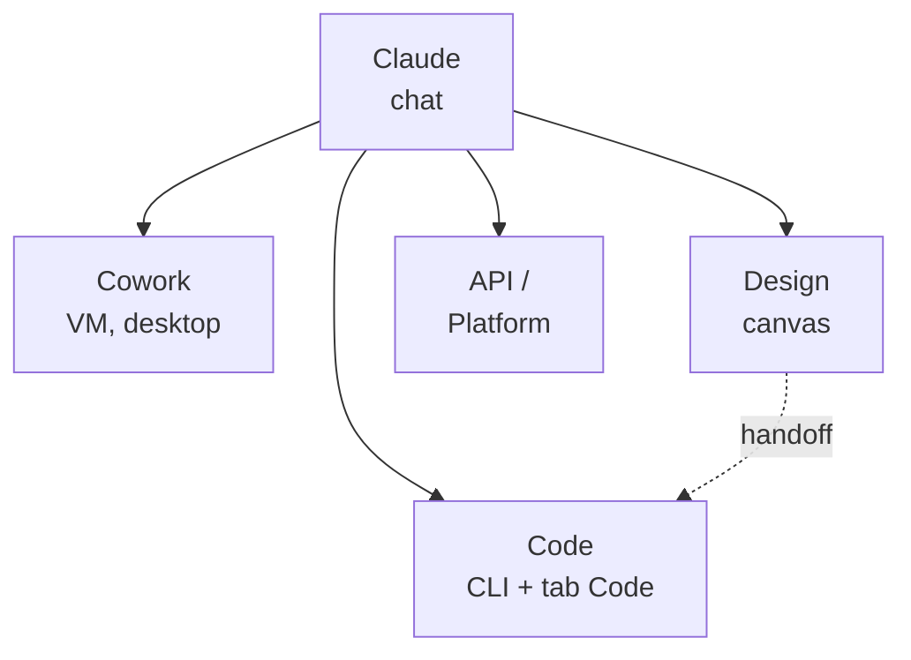

# L'ecosistema Claude

> Front matter — Livello 0.
> Dati di prodotto verificati il 22/06/2026 su fonti ufficiali.

## Obiettivo

Al termine avrai una mappa mentale dei prodotti Claude: cosa fa ciascuno, dove
gira e quando conviene usarlo rispetto agli altri. È la bussola che orienta
tutto il resto del libro.

## Un'unica intelligenza, molte porte d'accesso (EVERGREEN)

Sotto i vari prodotti c'è lo stesso motore: i modelli Claude. Cambia il modo in
cui ci accedi e cosa puoi fargli fare. La chat è la porta principale; le altre
porte aggiungono autonomia (Cowork), integrazione col codice (Code), lavoro
visuale (Design) o controllo programmatico (API).

*Figura F.2.1 — Le principali porte d'accesso a Claude.*
Alt-text: diagramma verticale con la chat in alto che si dirama in Code,
Cowork, Design e API; da Design parte un handoff verso Code.

## I prodotti, uno per uno (VOLATILE)

**Claude (chat).** L'assistente conversazionale su web, app desktop e mobile.
È il punto di partenza per domande, scrittura, analisi e generazione di file.
Disponibile a tutti i piani.

**Claude Code.** Lo strumento di coding agentico. Vive come comando da terminale
(CLI) e come tab **Code** nell'app desktop, sullo stesso motore. Serve a chi
sviluppa software. Richiede un piano a pagamento.

**Claude Cowork.** Porta le capacità agentiche nell'app desktop per lavoro non
di programmazione: ricerche, documenti, organizzazione di file. Gira in una VM
isolata (macchina virtuale separata dal sistema) e tocca solo le cartelle che
colleghi. Solo desktop, piani a pagamento; è in research preview.

**Claude Design.** Un canvas per creare UI, prototipi e presentazioni
conversando con Claude. Si integra con Code: quando un design è pronto, lo
"passi" allo sviluppo invece di ripartire da uno screenshot. Beta, a pagamento.

**Claude API / Developer Platform.** L'accesso programmatico ai modelli, con
SDK e Console. Serve a chi integra Claude nei propri software. È pay-as-you-go.

**Add-in e browser.** Claude vive anche dentro Excel/Word/PowerPoint (beta) e
come estensione per Chrome che agisce sulle pagine web (beta, a pagamento).

## Quando usare cosa (EVERGREEN)

La domanda giusta non è "quale prodotto è migliore", ma "qual è il più adatto a
questo compito". La tabella riassume la scelta.

Tabella F.2.1 — Prodotto, dove gira, quando conviene.

| Prodotto | Dove gira | Quando usarlo |
|---|---|---|
| Chat | web/desktop/mobile | domande, scrittura, analisi |
| Code | terminale + desktop | sviluppo software |
| Cowork | desktop (VM) | task lunghi sui tuoi file |
| Design | web/desktop | UI, prototipi, slide |
| API | server/codice | integrare Claude nei tuoi software |

> **Nota:** chat, Cowork e Code convivono nella stessa app desktop come tre tab.
> Cambiare tab significa cambiare modo di lavorare, non applicazione.

## Come si parlano tra loro (EVERGREEN)

Il valore vero nasce quando i prodotti si passano il lavoro. Da Design "passi"
un'interfaccia a Code, che la costruisce davvero invece di ripartire da zero.
Cowork e Code condividono la stessa cartella di progetto e le stesse istruzioni.
Una Skill scritta una volta (Livello 5) guida Claude allo stesso modo in chat,
in Cowork e in Code. Imparare i singoli prodotti è utile; imparare a farli
collaborare è ciò che rende Claude un ecosistema e non una somma di strumenti.

## Riepilogo

1. Sotto a tutto ci sono gli stessi modelli Claude: cambia la porta d'accesso.
2. La **chat** è il punto di partenza generale.
3. **Code** è per programmare; **Cowork** per task autonomi sui tuoi file.
4. **Design** copre la parte visuale e passa il lavoro a Code.
5. Le **API** servono a integrare Claude nei propri software.

## Prossimo passo

Nel **cap. F.3 — Modelli e piani** scegliamo il modello e il piano giusti:
quali differenze contano davvero e cosa sblocca ciascun abbonamento.
