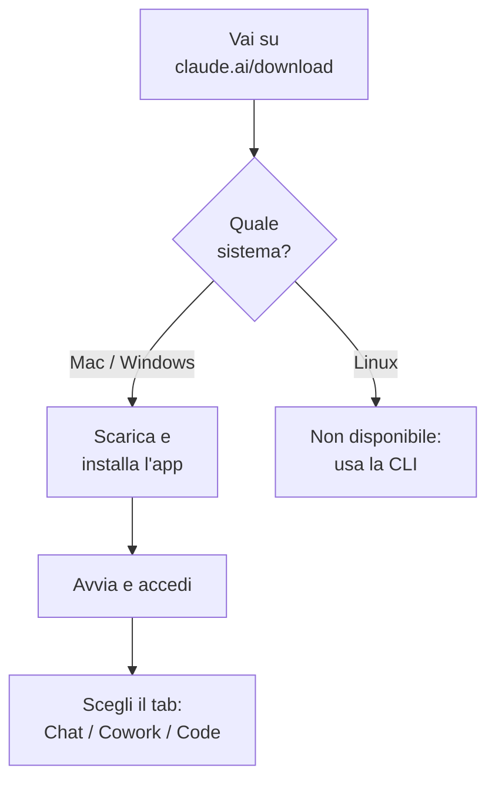

# Capitolo 2.1 — Installare Claude Desktop

> Livello 2 — Installazione locale.
> Dati di prodotto verificati il 22/06/2026 su fonti ufficiali.

## Obiettivo

Al termine avrai l'app Claude Desktop installata sul tuo computer, saprai
accedere e capirai a cosa servono i suoi tre tab: Chat, Cowork e Code.
Claude Desktop è l'applicazione che porta Claude direttamente sul desktop,
senza passare dal browser.

## Prerequisiti

- Un account Claude (vedi cap. F.3). Per la sola **Chat** basta accedere;
  per **Cowork** serve un piano a pagamento. (VOLATILE)
- Un computer **macOS o Windows**. Su Linux l'app non esiste: si usa la
  CLI (vedi cap. 2.2). (VOLATILE)
- Connessione internet attiva.

## Requisiti di sistema (VOLATILE)

L'app gira su sistemi recenti. Su Mac un'unica build copre sia i processori
Intel sia Apple Silicon; su Windows c'è una versione a parte per ARM64.

Tabella 2.1.1 — Sistemi supportati.

| Sistema | Versione minima | Note |
|---|---|---|
| macOS | 11 (Big Sur) | build Universal |
| Windows | 10 | x64; ARM64 a parte |
| Linux | — | non c'è: usa la CLI |

## Scaricare e installare (VOLATILE)

Il percorso è lo stesso per tutti: una pagina di download, un file da aprire,
un accesso. La figura 2.1.1 riassume il flusso, compreso il caso Linux.

*Figura 2.1.1 — Flusso di installazione di Claude Desktop.*
Alt-text: diagramma verticale dal download alla scelta del tab.

> **Nota:** la pagina di download riconosce il tuo sistema, ma puoi sempre
> scegliere a mano la versione macOS o Windows.

## I tre tab dell'app (EVERGREEN)

Una volta dentro, l'app si divide in tre aree. È utile sapere subito quale
serve a cosa, così non cerchi una funzione nel posto sbagliato.

Tabella 2.1.2 — A cosa serve ogni tab.

| Tab | A cosa serve |
|---|---|
| Chat | conversazioni con Claude |
| Cowork | task agentici lunghi e Dispatch |
| Code | sviluppo software in app |

Chat è il punto di partenza. Cowork affida a Claude lavori in più passi su una
cartella del tuo computer (lo vediamo nel Livello 3). Code porta in app le
capacità della CLI (Livello 2 e seguenti).

## In pratica: installa e accedi

1. Apri **claude.ai/download** e scegli macOS o Windows.
2. **Apri il file** scaricato per completare l'installazione.
3. Avvia Claude da **Applicazioni** (Mac) o dal **menu Start** (Windows).
4. **Accedi** con il tuo account.
5. Apri i tab e prova la Chat con un primo messaggio.

> **Tip (Windows + Code):** la prima volta che apri il tab **Code** su Windows
> serve **Git for Windows** installato. Installalo e **riavvia** l'app.

## Cowork: cosa sapere prima (VOLATILE)

Cowork è incluso nei piani a pagamento (Pro, Max, Team, Enterprise) e gira in
una **VM isolata** (macchina virtuale) sul tuo computer. Legge e scrive solo
nelle cartelle che colleghi, e la rete segue le tue impostazioni di egress
(traffico in uscita). Su Windows va abilitata la **Virtual Machine Platform**.

## Errori comuni

- **Sono su Linux e non trovo l'app.** Corretto: non esiste. Usa la CLI
  (cap. 2.2).
- **PC Windows ARM.** Scarica l'**installer ARM64** dedicato, non la x64.
- **Cowork non parte (Windows).** Verifica il piano a pagamento e che la
  **Virtual Machine Platform** sia abilitata.
- **Il tab Code dà errore al primo avvio (Windows).** Manca Git for Windows:
  installalo e riavvia l'app.

## Riepilogo

1. Claude Desktop è disponibile su **macOS 11+** e **Windows 10+**, non su
   Linux.
2. Si installa da **claude.ai/download**: scarica, apri, accedi.
3. L'app ha tre tab: **Chat**, **Cowork**, **Code**.
4. **Cowork** richiede un piano a pagamento e gira in una VM isolata.
5. Su Windows, il tab **Code** richiede **Git for Windows** alla prima
   apertura.

## Prossimo passo

Nel **cap. 2.2 — Installare Claude Code** vediamo la versione da riga di
comando (CLI), utile su Linux e per chi automatizza, e i metodi di
installazione con la relativa manutenzione.

---

*Dati verificati il 22/06/2026 su support.claude.com (Install Claude Desktop)
e code.claude.com/docs/en/desktop. L'installazione è grafica e legata
all'account, quindi non è stata eseguita nella VM; i passaggi sono riportati
fedelmente dalla documentazione ufficiale.*
