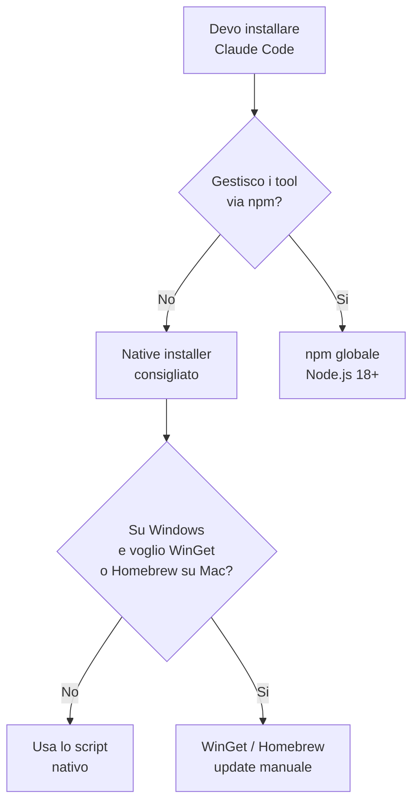

# Capitolo 2.2 — Installare Claude Code

> Livello 2 — Installazione locale.
> Dati di prodotto verificati il 21/06/2026 su fonti ufficiali.

## Obiettivo

Al termine avrai Claude Code installato sul tuo computer, saprai scegliere
il metodo giusto per il tuo sistema operativo e avrai verificato che
funzioni. Claude Code e lo strumento da riga di comando (CLI) che lavora
direttamente sui file del tuo progetto.

## Prerequisiti

- Un account a pagamento: **Pro, Max, Team, Enterprise o Console (API)**.
  Il piano Free non include Claude Code (vedi cap. F.3 e il ledger). (VOLATILE)
- Un terminale aperto. Se non l'hai mai usato, vedi il cap. 2.1.
- Connessione internet attiva.

## Quale metodo scegliere (EVERGREEN)

Esistono piu modi di installare, ma per quasi tutti la scelta e semplice:
il **native installer**. Non richiede Node.js e si aggiorna da solo in
background. Gli altri metodi servono in casi specifici.

*Figura 2.2.1 — Albero di decisione per il metodo di installazione.*
Alt-text: diagramma verticale che guida dalla scelta del metodo.



> **Nota:** native installer, Homebrew, WinGet e npm installano **lo stesso
> binario**. Cambia solo come arriva e come si aggiorna.

## Installazione con il native installer (consigliato)

Apri il terminale ed esegui il comando per il tuo sistema. (VOLATILE)

**macOS, Linux, WSL**

```bash
curl -fsSL https://claude.ai/install.sh | bash
```

**Windows — PowerShell**

```powershell
irm https://claude.ai/install.ps1 | iex
```

**Windows — CMD**

Il comando va su **una riga sola**; qui e spezzato con `^` per la stampa.

```bat
curl -fsSL https://claude.ai/install.cmd ^
  -o install.cmd && install.cmd ^
  && del install.cmd
```

> **Attenzione (Windows):** se vedi l'errore *"The token '&&' is not a valid
> statement separator"* sei in PowerShell, non in CMD. Il prompt mostra
> `PS C:\` in PowerShell e `C:\` senza `PS` in CMD.

Su Windows nativo, **Git for Windows** e opzionale ma consigliato: abilita il
Bash tool. Senza Git, Claude Code usa il PowerShell tool.

## Metodi alternativi (VOLATILE)

Tabella 2.2.1 — Quando usare un metodo diverso.

| Metodo | Comando | Aggiornamento |
|---|---|---|
| Homebrew (mac) | `brew install --cask claude-code` | manuale |
| WinGet (Win) | `winget install Anthropic.ClaudeCode` | manuale |
| npm | `npm install -g @anthropic-ai/claude-code` | manuale |

Per npm serve **Node.js 18+**. Regola d'oro: **mai** `sudo npm install -g`,
perche crea problemi di permessi e rischi di sicurezza. Per aggiornare usa
`npm install -g @anthropic-ai/claude-code@latest`, non `npm update -g`.

Su Debian/Ubuntu, Fedora/RHEL e Alpine esistono anche repository firmati
(apt, dnf, apk) su `downloads.claude.ai`: utili in azienda, si aggiornano
con il normale gestore di sistema.

## In pratica: installa e verifica

1. Esegui il comando del native installer per il tuo sistema.
2. **Apri un nuovo terminale** (per ricaricare il PATH).
3. Controlla la versione:

   ```bash
   claude --version
   ```

4. Esegui la diagnosi di installazione e configurazione:

   ```bash
   claude doctor
   ```

5. Entra in una cartella di **progetto reale** (non vuota) e avvia:

   ```bash
   claude
   ```

   Al primo avvio si apre il browser per il login: segui le istruzioni.

## Errori comuni

- **`command not found` dopo l'installazione.** Apri un nuovo terminale. Il
  binario nativo sta in `~/.local/bin/claude`: assicurati che quella cartella
  sia nel PATH.
- **Tab/login rifiutato.** Verifica che l'account sia a pagamento: il Free
  non include Claude Code.
- **Errori di permessi con npm.** Non usare `sudo`. Punta il prefix di npm a
  una cartella tua o usa nvm.
- **Git Bash non trovato (Windows).** Imposta il percorso in `settings.json`:

  ```json
  {
    "env": {
      "CLAUDE_CODE_GIT_BASH_PATH":
        "C:\\Program Files\\Git\\bin\\bash.exe"
    }
  }
  ```

## Riepilogo

1. Per quasi tutti, il **native installer** e la scelta giusta: niente Node,
   auto-update.
2. Tre comandi diversi per macOS/Linux/WSL, PowerShell e CMD.
3. npm, Homebrew e WinGet installano lo stesso binario, ma si aggiornano a mano.
4. Serve un account a pagamento; **mai** `sudo` con npm.
5. Verifica sempre con `claude --version` e `claude doctor`.

## Prossimo passo

Nel **cap. 2.3 — Autenticazione e primi controlli** completiamo il login,
vediamo l'uso con API key negli ambienti automatizzati e leggiamo l'output
di `claude doctor` per risolvere i problemi piu frequenti.

---

*Comandi verificati su code.claude.com/docs/en/setup il 21/06/2026.
Eseguibilita nella VM: gli script di installazione richiedono rete verso
claude.ai e un account, quindi non sono stati eseguiti qui; i comandi sono
riportati fedelmente dalla documentazione ufficiale.*
