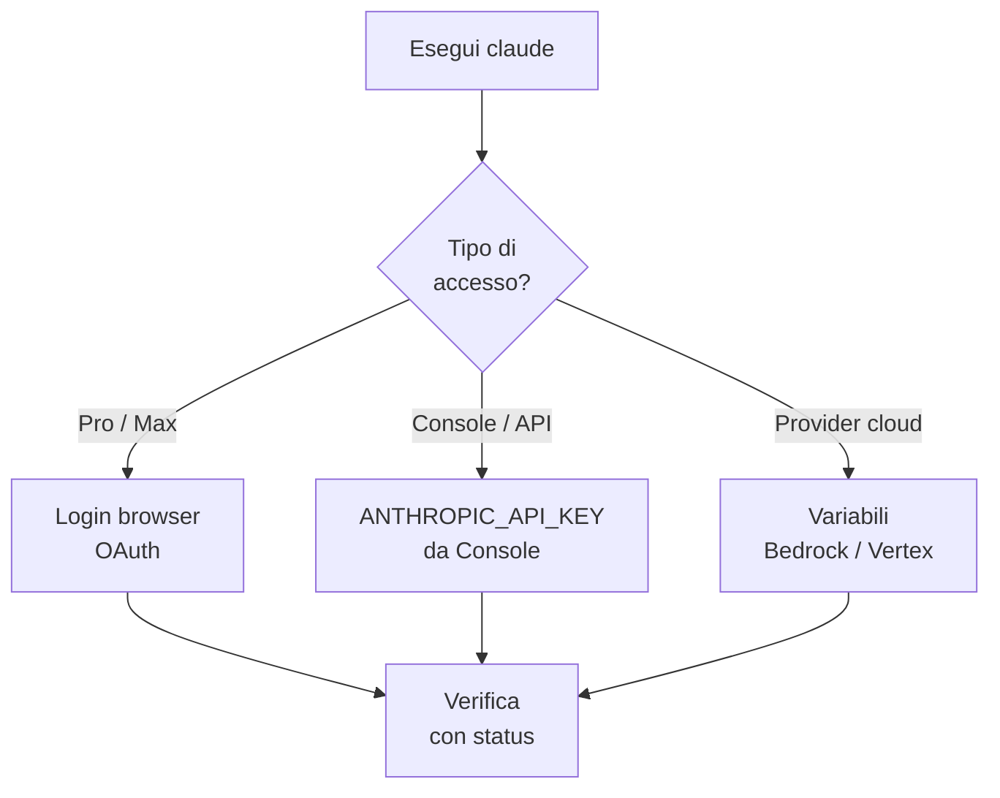

# Capitolo L2.3 — Autenticazione e controlli

> Livello 2 — Installazione locale.
> Dati di prodotto verificati il 22/06/2026 su fonti ufficiali.

## Obiettivo

Al termine saprai accedere a Claude Code con il metodo giusto — abbonamento o
API key — capire quale credenziale è attiva e diagnosticare i problemi più
comuni di login e di PATH. È il passo che trasforma un'installazione in uno
strumento pronto all'uso.

## Prerequisiti

- Claude Code installato e funzionante (vedi cap. L2.2). (VOLATILE)
- Un account a pagamento o una API key da Console (vedi cap. F.3). (VOLATILE)

## Il primo accesso (VOLATILE)

Dopo l'installazione, entra in una cartella di progetto ed esegui:

```bash
claude
```

Al primo avvio Claude Code apre il browser per il login (OAuth, accesso
delegato senza digitare la password nel terminale). Accedi con il tuo account
Claude.ai e torni al terminale già autenticato. Se il browser non si apre da
solo, premi `c` per copiare l'URL e incollarlo a mano.

A seconda di chi sei, accedi con un abbonamento **Pro o Max** (account
Claude.ai), un account **Team/Enterprise** invitato dall'amministratore, oppure
credenziali **Claude Console** se la tua organizzazione fattura via API.

> **Nota:** per uscire e ri-autenticarti digita `/logout` al prompt di Claude
> Code; `/login` riavvia l'accesso.

## Due strade: abbonamento o API key (EVERGREEN)

Le due modalità più comuni rispondono a bisogni diversi. L'**abbonamento**
(login da browser) è la scelta normale quando lavori al computer. La **API key**
serve quando un browser non c'è: server, pipeline di CI, script automatici. Lì
il login interattivo non è praticabile, e si usa una chiave generata nella
Console.

*Figura L2.3.1 — Come scegliere il metodo di accesso.*
Alt-text: diagramma verticale che dal comando claude porta a tre vie di accesso
e poi alla verifica con lo stato.



Tabella L2.3.1 — I metodi di autenticazione.

| Metodo | Per chi | Come |
|---|---|---|
| OAuth | uso al computer | login browser |
| API key | headless / CI | ANTHROPIC_API_KEY |
| Cloud | Bedrock/Vertex | variabili dedicate |

## Usare una API key headless (VOLATILE)

Genera la chiave nella Console (platform.claude.com) e impostala come variabile
d'ambiente. Su macOS e Linux:

```bash
export ANTHROPIC_API_KEY=sk-ant-...
```

Su Windows (PowerShell):

```powershell
$env:ANTHROPIC_API_KEY = "sk-ant-..."
```

In modalità interattiva, Claude Code ti chiede una volta di approvare la chiave
e ricorda la scelta. In modalità non interattiva (`claude -p`) la chiave viene
usata sempre, senza chiedere: è ciò che serve negli script.

## Quale credenziale vince (EVERGREEN)

Se più credenziali sono presenti, Claude Code ne sceglie una con un ordine
fisso, dalla più forte alla più debole:

1. provider cloud (`CLAUDE_CODE_USE_BEDROCK` e simili);
2. `ANTHROPIC_AUTH_TOKEN` (bearer per gateway o proxy);
3. `ANTHROPIC_API_KEY`;
4. script `apiKeyHelper` (credenziali a rotazione);
5. abbonamento OAuth da `/login`.

Conoscere l'ordine spiega la trappola più frequente: se hai un abbonamento
attivo **ma** anche `ANTHROPIC_API_KEY` impostata, vince la key. Se quella
chiave appartiene a un'organizzazione disabilitata, il login fallisce pur avendo
un abbonamento valido.

> **Attenzione:** queste variabili valgono solo per la CLI da terminale. Claude
> Desktop e le sessioni remote usano sempre OAuth e ignorano `ANTHROPIC_API_KEY`.

## Dove finiscono le credenziali (VOLATILE)

Claude Code conserva il login in modo sicuro: su macOS nel **Keychain** cifrato;
su Linux e Windows nel file `~/.claude/.credentials.json` (su Linux con permessi
`0600`), oppure sotto `$CLAUDE_CONFIG_DIR` se impostata. Non devi gestirlo a
mano, ma sapere dov'è aiuta per backup o reset.

## In pratica: accedi e verifica

1. Entra in una cartella di progetto ed esegui `claude`.
2. Completa il login nel browser (o premi `c` per copiare l'URL).
3. Controlla quale metodo è attivo con `/status`.
4. Se serve la diagnosi dell'installazione:

   ```bash
   claude doctor
   ```

5. In un ambiente automatizzato imposta `ANTHROPIC_API_KEY` e avvia
   con `claude -p`.

## Errori comuni

- **Login fallito con abbonamento valido.** Probabile `ANTHROPIC_API_KEY` di
  troppo: esegui `unset ANTHROPIC_API_KEY` e ricontrolla con `/status`.
- **`command not found` dopo l'installazione.** Apri un nuovo terminale; il
  binario è in `~/.local/bin/claude`, che deve stare nel PATH (vedi cap. L2.2).
- **Il browser non si apre al login.** Premi `c` per copiare l'URL e aprilo a
  mano.
- **API key ignorata nel Desktop.** È normale: il Desktop usa solo OAuth.

## Riepilogo

1. Al primo `claude` si accede dal **browser** con l'account Claude.ai.
2. Per gli ambienti **headless** si usa `ANTHROPIC_API_KEY` dalla Console.
3. Con più credenziali vince un **ordine fisso**: la API key batte l'abbonamento.
4. `/status` dice quale metodo è attivo; `/logout` ripulisce l'accesso.
5. `claude doctor` diagnostica installazione e configurazione.

## Prossimo passo

Nel **cap. L2.4 — Configurare il progetto** prepariamo `CLAUDE.md`, la cartella
`.claude` e i permessi, per far partire Claude Code già "sul pezzo" su un repo
reale.

---

*Dati verificati il 22/06/2026 su code.claude.com/docs/en/authentication e
support.claude.com (troubleshoot Claude Code). Login OAuth e API key richiedono
un account reale, quindi non sono stati eseguiti nella VM; comandi e variabili
sono riportati fedelmente dalla documentazione ufficiale.*
