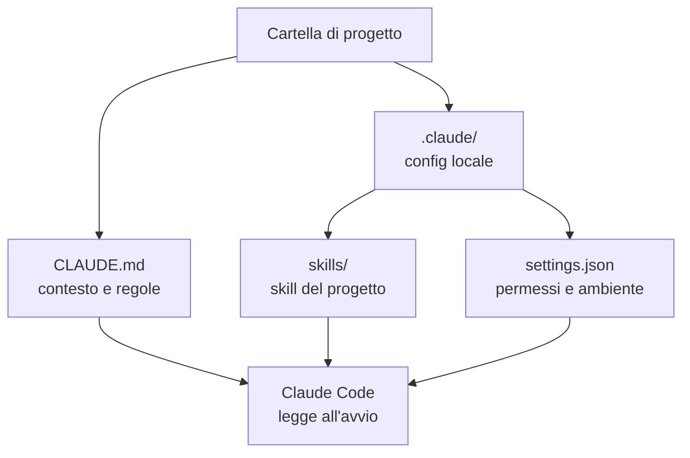

# Capitolo L2.4 — Configurare il progetto

> Livello 2 — Installazione locale.
> Concetti stabili; dettagli di prodotto verificati su fonti ufficiali.

## Obiettivo

Al termine saprai preparare una cartella di progetto perche Claude Code ci
lavori bene: scrivere un file `CLAUDE.md` che dà il contesto, capire a cosa
serve la cartella `.claude/`, e impostare i permessi così Claude agisce senza
chiederti conferma a ogni passo, ma neanche di nascosto.

## Prerequisiti

- Claude Code installato e funzionante (vedi cap. L2.2).
- Login completato (vedi cap. L2.3).
- Una cartella di progetto **reale**: codice, documenti, qualunque cosa su cui
  vuoi lavorare. Claude Code rende meglio su un progetto vero che su una cartella
  vuota.

## Perche serve configurare (EVERGREEN)

Claude Code parte senza sapere nulla del tuo progetto. Ogni volta che apri una
sessione, ricostruisce il contesto leggendo i file. Puoi spiegargli tutto a voce
 a ogni avvio, oppure scriverlo una volta in un file che legge da solo. La
seconda strada è quella che ripaga: meno ripetizioni, comportamento più
prevedibile, e le stesse regole valgono per chiunque apra il progetto.

Tre elementi fanno la configurazione: il file `CLAUDE.md` (il contesto), la
cartella `.claude/` (skill, comandi, impostazioni locali) e i permessi (cosa
Claude può fare senza chiedere).

*Figura L2.4.1 — Cosa legge Claude Code all'avvio in una cartella di progetto.*
Alt-text: diagramma verticale che mostra la cartella di progetto con CLAUDE.md
e la sottocartella .claude e il loro ruolo.



## Il file CLAUDE.md (EVERGREEN)

`CLAUDE.md` è un file di testo in formato Markdown che metti nella radice del
progetto. Claude Code lo legge a ogni avvio e ne tratta il contenuto come
istruzioni da seguire. È il posto giusto per le cose che non vuoi ripetere:

- **Cos'è il progetto:** una frase o due su scopo e struttura.
- **Comandi che usi spesso:** come si avvia, come si testa, come si compila.
- **Convenzioni:** stile del codice, nomi, cose da non toccare.
- **Vincoli:** "non modificare la cartella X", "i commenti in inglese".

La regola è: poco e utile. Un `CLAUDE.md` enorme si diluisce; uno mirato pesa
su ogni risposta. Scrivi le istruzioni come le diresti a una persona nuova nel
team al primo giorno.

> **Tip:** dentro Claude Code, il comando `/init` analizza il progetto e ti
> propone un primo `CLAUDE.md`. È un buon punto di partenza da rifinire a mano,
> non un risultato finito.

Un esempio minimo:

```markdown
# Progetto: API ordini

App Node.js. Avvio: `npm run dev`.
Test: `npm test`. Non modificare `db/migrations/`.
Commenti nel codice in inglese.
```

## La cartella .claude/ (EVERGREEN)

Accanto a `CLAUDE.md` puoi avere una cartella `.claude/`. Raccoglie la
configurazione locale del progetto:

- `.claude/skills/` — le skill specifiche di questo progetto (vedi Livello 5).
- `.claude/settings.json` — permessi e variabili d'ambiente del progetto.

Il vantaggio è che questa configurazione vive **dentro** il progetto: se è in un
repository git, la condividi con il team e la versioni come il resto. Chi clona
il progetto eredita le stesse regole.

## Permessi: il giusto mezzo (EVERGREEN)

Claude Code chiede conferma prima di azioni che cambiano qualcosa: modificare un
file, eseguire un comando. È una protezione, ma confermare tutto rallenta. I
permessi servono a dire in anticipo "queste cose le puoi fare senza chiedere,
queste mai".

Si impostano in `.claude/settings.json`. Lo schema di base distingue ciò che è
sempre permesso (`allow`) da ciò che è sempre negato (`deny`):

```json
{
  "permissions": {
    "allow": ["Bash(npm test)"],
    "deny": ["Bash(rm -rf *)"]
  }
}
```

La filosofia: concedi le azioni ripetitive e sicure (lanciare i test, leggere
file), tieni la conferma per quelle che spostano o cancellano. Non aprire tutto
"per comodità": il senso del passaggio di conferma è che tu resti l'ultima
parola sulle azioni che contano.

## In pratica: prepara una cartella

1. Apri il terminale ed entra nel tuo progetto:

   ```bash
   cd ~/progetti/mia-app
   ```

2. Avvia Claude Code:

   ```bash
   claude
   ```

3. Genera una bozza di contesto:

   ```text
   /init
   ```

4. Apri `CLAUDE.md`, taglia il superfluo, aggiungi i comandi che usi e le cose
   da non toccare.
5. Se hai regole su comandi ricorrenti, crea `.claude/settings.json` con i
   permessi `allow`/`deny`.
6. Se il progetto è in git, fai un commit: ora la configurazione viaggia con il
   codice.

## Errori comuni

- **CLAUDE.md troppo lungo.** Diventa rumore. Tieni solo ciò che cambia il
  comportamento: scopo, comandi, vincoli.
- **Permessi troppo larghi.** Mettere tutto in `allow` annulla la rete di
  sicurezza. Concedi il ripetitivo e sicuro, non il distruttivo.
- **Configurazione fuori dal repo.** Se `.claude/` e `CLAUDE.md` non sono
  versionati, il team non li eredita e le regole valgono solo per te.
- **Partire da una cartella vuota.** Claude Code dà il meglio su un progetto
  reale. Per imparare, usa un repo che già conosci.

## Riepilogo

1. `CLAUDE.md` è il contesto che Claude Code legge a ogni avvio: scopo, comandi,
   convenzioni, vincoli.
2. Tienilo corto e mirato: poco e utile batte lungo e generico.
3. La cartella `.claude/` raccoglie skill e impostazioni locali del progetto.
4. I permessi (`allow`/`deny`) bilanciano velocità e controllo: concedi il
   sicuro, conferma il distruttivo.
5. Versiona `CLAUDE.md` e `.claude/` nel repo: così le regole valgono per tutti.

## Prossimo passo

Con l'installazione locale completa, il **Livello 3 — Lavoro quotidiano** entra
nell'uso di tutti i giorni. Si parte dal **cap. L3.1 — Cowork: primi passi**,
dove deleghi a Claude un compito su una cartella e impari ad approvare le sue
azioni.

---

*Concetti (CLAUDE.md, permessi, struttura del progetto) verificati su
code.claude.com/docs il 24/06/2026. I comandi `/init` e l'avvio di `claude`
richiedono un account attivo e non sono stati eseguiti in questa sede.*
