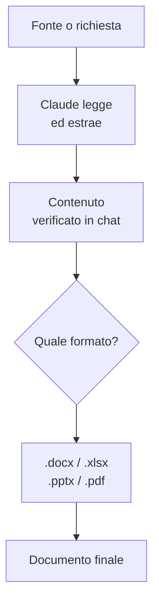

# Capitolo L3.4 — Documenti (Word, PowerPoint, Excel, PDF)

> Livello 3 — Lavoro quotidiano.
> Dati di prodotto verificati il 22/06/2026 su fonti ufficiali.

## Obiettivo

Al termine saprai far generare a Claude documenti professionali — Word, Excel,
PowerPoint, PDF — chiedendoli nel modo giusto, sfruttando il principio "prima il
contenuto, poi il file", e partendo da un modello quando vuoi un risultato
ripetibile.

## Prerequisiti

- Saper scrivere richieste chiare (vedi cap. L1.2).
- Avere attiva la **code execution / file creation** (vedi cap. L1.3): è la
  sandbox con cui Claude crea i file. È su tutti i piani. (VOLATILE)

## Come Claude crea i file (VOLATILE)

Claude non "scrive a mano" un .docx: usa una sandbox di esecuzione codice che
genera il file vero, con la formattazione che serve. Per questo i documenti
prodotti sono file reali — apribili in Word, Excel, PowerPoint — non semplice
testo incollato. Il limite per file è intorno ai **30 MB**. (VOLATILE)

I formati tipici: **.docx** (Word), **.xlsx** (Excel), **.pptx** (PowerPoint),
**.pdf**. La regola per scegliere è il destinatario: un report da rileggere e
modificare è un .docx; dati e calcoli sono un .xlsx; qualcosa da presentare è un
.pptx; un documento finale da distribuire così com'è è un .pdf.

## Chiederli bene (EVERGREEN)

Un documento è buono quanto la richiesta. Tre cose alzano la qualità del
risultato:

- **Il destinatario e lo scopo:** "una nota per il consiglio", "un volantino per
  i clienti". Cambia tono, lunghezza, struttura.
- **La struttura che vuoi:** le sezioni, l'ordine, cosa mettere in evidenza.
- **Il formato finale:** dì esplicitamente .docx, .xlsx, .pptx o .pdf.

Confronta:

- **Debole:** "Fammi un documento sulle vendite."
- **Meglio:** "Crea un report .docx di una pagina sulle vendite del Q1 per la
  direzione: una sintesi iniziale, una tabella per regione, tre punti di
  commento. Tono sobrio."

## Prima il contenuto, poi il file (EVERGREEN)

Il principio che fa la differenza è "**read before create**": prima si fissa il
contenuto, poi lo si impagina. Un documento nasce male se chiedi
contemporaneamente "trova i dati e fammi il PDF": il rischio è una bella
impaginazione su contenuti sbagliati.

Conviene separare i due momenti:

1. **Contenuto.** Fai produrre o verificare a Claude i dati, i testi, i numeri.
   Controllali in chat.
2. **Documento.** Solo quando il contenuto è giusto, chiedi di metterlo nel file
   con la formattazione voluta.

Se parti da un file esistente — un report da riassumere, dati da rielaborare —
vale lo stesso: prima Claude **legge** la fonte ed estrae ciò che serve, poi
costruisce il nuovo documento. Impaginare per primo significa rifare il lavoro.

*Figura L3.4.1 — Il flusso "prima il contenuto, poi il file".*
Alt-text: diagramma verticale dal contenuto verificato alla scelta del formato
fino al documento finale.



## Partire da un modello (EVERGREEN)

Se produci lo stesso tipo di documento spesso — un report mensile, un'offerta —
non ripartire da zero ogni volta. Dai a Claude un **modello**: un file di
esempio già impostato, o una descrizione precisa della struttura. Lui ci versa
dentro il contenuto nuovo mantenendo forma e stile.

È il ponte naturale verso i Project (cap. L3.2): metti il modello nella
knowledge base e ogni documento esce coerente con il precedente. Per la voce e
le regole di stile ricorrenti, le Skills (Livello 5) rendono tutto questo
ancora più ripetibile.

## In pratica: un report in due tempi

1. In chat, fai preparare e **controlla il contenuto**:

   ```text
   Dai dati che ti incollo, scrivi la sintesi e
   la tabella per regione. Mostrameli, non fare
   ancora il file.
   ```

2. Correggi quel che serve finché il contenuto è giusto.
3. Chiedi il documento, con formato e struttura:

   ```text
   Ora mettilo in un .docx di una pagina: titolo,
   sintesi, tabella, tre punti di commento.
   ```

4. Apri il file e verifica. Per i ritocchi, chiedi modifiche puntuali invece di
   rigenerare tutto.

## Errori comuni

- **Chiedere dati e impaginazione insieme.** Separa: prima il contenuto giusto,
  poi il file.
- **Non dire il formato.** Senza ".docx" o ".xlsx" rischi un output generico.
  Sii esplicito.
- **Rigenerare per ogni ritocco.** Chiedi modifiche mirate ("cambia solo la
  tabella"): più veloce e più sicuro.
- **Dimenticare la sandbox.** Se la creazione file non parte, controlla che la
  code execution sia attiva (cap. L1.3). (VOLATILE)

## Riepilogo

1. Claude genera file reali (.docx, .xlsx, .pptx, .pdf) tramite la sandbox di
   esecuzione codice.
2. Scegli il formato in base al destinatario: report, dati, presentazione,
   documento finale.
3. Chiedi bene: destinatario, struttura, formato esplicito.
4. "Prima il contenuto, poi il file": verifica i contenuti in chat, poi
   impagina.
5. Per documenti ricorrenti parti da un modello; con i Project diventa
   ripetibile.

## Prossimo passo

Nel **cap. L3.5 — Slide ed Excel** entriamo nei due casi più richiesti:
costruire una presentazione e un foglio di calcolo con un metodo che evita di
rifare il lavoro, e l'uso degli add-in dentro Office.

---

*Dati su code execution / creazione file (piani, limite ~30 MB) dal ledger,
verificati il 22/06/2026 su support.claude.com. Gli esempi non sono stati
eseguiti in questa sede.*
