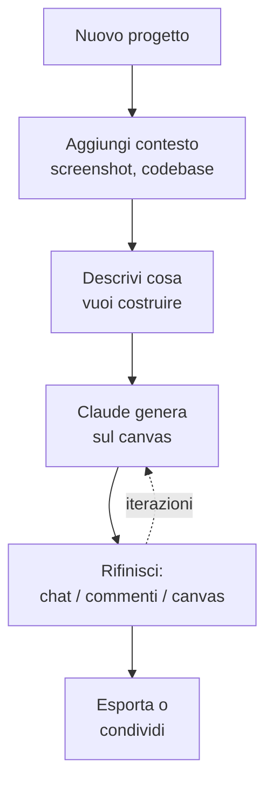

# Capitolo L4.1 — Design: il canvas

> Livello 4 — Design.
> Dati di prodotto verificati il 24/06/2026 su fonti ufficiali.

## Obiettivo

Al termine saprai cos'è Claude Design, generare il tuo primo progetto sul
canvas conversando, e rifinirlo nei tre modi che il prodotto offre: dalla chat,
con i commenti inline e modificando direttamente sulla tela. Imparerai anche a
chiedere varianti e a salvare una direzione prima di provarne un'altra.

## Prerequisiti

- Saper scrivere richieste efficaci (cap. L1.2): valgono identiche qui.
- Un piano a pagamento: **Pro, Max, Team o Enterprise**. Design è in beta e su
  Enterprise è **disattivato di default** (lo abilita un admin). (VOLATILE)

## Cos'è Claude Design (VOLATILE)

Claude Design è lo strumento per creare interfacce, prototipi interattivi e
presentazioni **conversando** con Claude, invece di disegnare a mano. Lo usi sul
web (claude.ai/design) o dalla sidebar dell'app desktop; non c'è su mobile.

La schermata ha due aree: la **chat a sinistra**, dove descrivi cosa vuoi, e il
**canvas** (la tela) a destra, dove Claude genera il design. Da lì si itera:
affini conversando, lasci commenti su punti precisi, o intervieni a mano sulla
tela. È lo stesso principio della chat — descrivi il risultato, poi correggi —
applicato a un output visuale.

## Il flusso di lavoro (EVERGREEN)

Un progetto Design segue quasi sempre lo stesso percorso.

*Figura L4.1.1 — Il flusso di un progetto in Claude Design.*
Alt-text: diagramma verticale dal nuovo progetto alla descrizione, alla
generazione sul canvas, alla rifinitura, all'export.



Il progetto eredita in automatico il design system della tua organizzazione, se
configurato (lo vediamo nel cap. L4.2): colori, font e componenti sono già al
posto giusto, senza caricare nulla.

## Scrivere un buon prompt (EVERGREEN)

Non serve essere designer. Serve essere specifici. Un buon prompt dichiara
quattro cose:

- **Goal:** cosa stai costruendo.
- **Layout:** come disporre gli elementi.
- **Content:** quali informazioni mostrare.
- **Audience:** chi lo userà.

Per esempio: «Crea una dashboard che mostra il fatturato mensile, con filtri per
regione e linea di prodotto». Se manca qualcosa di importante, Claude fa domande
prima di generare.

## Tre modi per rifinire (EVERGREEN)

La prima generazione è un punto di partenza. Il valore vero è nell'iterazione, e
il prodotto offre tre strade — usarle al momento giusto fa risparmiare tempo.

Tabella L4.1.1 — Quale strumento per quale modifica.

| Strumento | Per cosa | Esempio |
|---|---|---|
| Chat | cambi ampi, strutturali | "tema più scuro" |
| Commenti inline | mirati, su un componente | "padding più largo" |
| Modifica diretta | ritocchi visivi rapidi | trascina, ridimensiona |

La **chat** è per i cambi che toccano l'insieme o richiedono una spiegazione
("riorganizza la dashboard", "aggiungi un pannello a destra"). I **commenti
inline** si applicano cliccando direttamente sull'elemento: più rapidi che
descrivere a parole dov'è. La **modifica diretta** sul canvas serve per spostare,
ridimensionare e allineare al volo.

> **Attenzione:** a volte un commento inline sparisce prima che Claude lo legga.
> È un problema noto: se la modifica non viene raccolta, incolla lo stesso
> feedback nella chat. (VOLATILE)

## Varianti e versioni (EVERGREEN)

Due mosse utili quando non hai ancora deciso la direzione. Per esplorare
alternative, chiedi: «Mostrami 2-3 layout diversi per questa pagina»: confrontare
è più veloce che indovinare. Per cambiare strada senza perdere il lavoro fatto,
di' a Claude: «Salva quello che abbiamo e prova un approccio completamente
diverso». Claude conserva la versione attuale e ti conferma dove l'ha salvata,
così puoi tornarci.

## In pratica: il tuo primo progetto

1. Apri **claude.ai/design** o la sidebar Design nell'app, e crea un progetto.
2. Aggiungi contesto se ne hai: uno screenshot di riferimento, un codebase.
3. Scrivi il prompt con **goal, layout, content, audience**:

   ```text
   Landing page per il nostro nuovo prodotto API:
   hero, esempi di codice, sezione prezzi.
   Pubblico: sviluppatori.
   ```

4. Guarda cosa genera sul canvas.
5. Rifinisci: chat per i cambi grossi, commenti per i dettagli, mano libera per
   gli allineamenti.
6. Chiedi 2-3 varianti del layout e scegli da lì.

## Errori comuni

- **Prompt vago.** "Fammi un sito" produce risultati generici. Dichiara goal,
  layout, content, audience.
- **Tutto dalla chat.** Per spostare un elemento o cambiare un padding, commenti
  inline e modifica diretta sono più rapidi.
- **Feedback non raccolto.** Se un commento inline sparisce, incollalo in chat.
  (VOLATILE)
- **Cercare Design su mobile.** È solo web e desktop. (VOLATILE)

## Riepilogo

1. Claude Design crea UI, prototipi e slide **conversando**; chat a sinistra,
   canvas a destra. Solo web e desktop.
2. Il flusso: progetto → contesto → prompt → generazione → rifinitura → export.
3. Un buon prompt dichiara **goal, layout, content, audience**.
4. Rifinisci con **chat** (cambi ampi), **commenti inline** (mirati), **modifica
   diretta** (ritocchi visivi).
5. Chiedi **varianti** e **salva una versione** prima di cambiare direzione.

## Prossimo passo

Nel **cap. L4.2 — Design system import** vediamo come far partire Design dal tuo
brand reale: importare colori, font e componenti da un codebase o da un deck, e
ridurre il rischio di un output anonimo.

---

*Dati su Claude Design (aree, flusso, rifinitura, beta/piani) verificati il
24/06/2026 su support.claude.com/en/articles/14604416. Il canvas richiede un
account a pagamento, quindi i passaggi non sono stati eseguiti in questa sede.*
