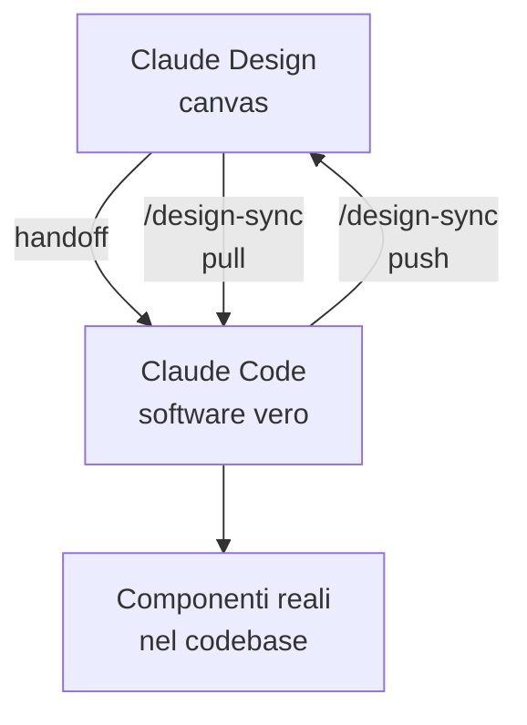

# Capitolo L4.3 — Da Design a codice (/design-sync)

> Livello 4 — Design.
> Dati di prodotto verificati il 24/06/2026 su fonti ufficiali.

## Obiettivo

Al termine capirai il ponte tra Claude Design e Claude Code: come `/design-sync`
collega canvas e codice nei due versi, come passare un design a Claude Code
perché diventi software vero senza ripartire da uno screenshot, e come avviare un
progetto Design direttamente dal terminale. È il capitolo che fa di Design e Code
un ciclo unico invece di due strumenti separati.

## Prerequisiti

- Claude Code installato e configurato (cap. L2.2, L2.4).
- Aver usato il canvas (cap. L4.1) e, idealmente, importato un design system
  (cap. L4.2).

## Il problema che risolve (EVERGREEN)

Il punto dolente classico del lavoro design→sviluppo è il salto: il designer
consegna uno screenshot o un file, e chi sviluppa **ricostruisce tutto da capo**.
Si perde tempo e fedeltà. Il ponte tra Design e Code elimina questo passaggio:
Claude Code continua dal lavoro esistente, non da una foto del risultato.

## Il ciclo Design ↔ Code (EVERGREEN)

Design e Code non sono una catena a senso unico, ma un anello. Il design genera
codice; il codice, evolvendo, aggiorna il design. `/design-sync` tiene allineati
i due lati.

*Figura L4.3.1 — Il ciclo a due vie tra Design e Code.*
Alt-text: diagramma verticale che mostra il canvas e il codice collegati da pull
e push, con l'handoff verso Claude Code.



## /design-sync nei due versi (VOLATILE)

Il comando `/design-sync` si esegue **dentro Claude Code** e funziona in due
direzioni.

- **Pull (codice → canvas):** importa il design system del tuo codebase locale in
  Claude Design, così ogni schermata che generi parte dai tuoi componenti reali.
- **Push (canvas → codice):** dopo che hai implementato un design nel codice,
  `/design-sync` rimanda nel canvas lo stato attuale, tenendo Design allineato a
  ciò che hai davvero costruito.

In pratica: parti dal codice per dare a Design le fondamenta giuste (pull),
costruisci e iteri, poi rimandi indietro il risultato per non far divergere
canvas e prodotto (push).

Tabella L4.3.1 — Le due direzioni di `/design-sync`.

| Verso | Da → A | A cosa serve |
|---|---|---|
| Pull | codice → canvas | design su componenti reali |
| Push | canvas → codice | canvas allineato al build |

## L'handoff a Claude Code (VOLATILE)

Quando un design è pronto a diventare software, lo **passi** a Claude Code
(handoff). Code continua dal lavoro esistente invece di ricostruirlo da uno
screenshot. L'handoff si avvia anche dal pulsante **Export** di Design (vedi cap.
L4.5) e può puntare al coding agent locale o a Claude Code Web.

## Partire da Claude Code: /design (VOLATILE)

Se preferisci restare nel terminale, non sei obbligato ad aprire il canvas. Con
il comando `/design` avvii, modifichi e sincronizzi un progetto Design **senza
lasciare Claude Code**: importi un design nel codebase, esporti il codice come
prototipo live, o lasci che Claude costruisca tutto da capo.

> **Nota:** se in Claude Code non vedi `/design` o `/design-sync`, esegui
> `/update` per aggiornare le skill. I comandi compaiono solo nelle **sessioni
> nuove**, non in quella già aperta. (VOLATILE)

## In pratica: dal codebase al canvas e ritorno

1. In Claude Code, dentro il tuo progetto, esegui:

   ```text
   /design-sync
   ```

2. Scegli **pull**: importi il design system del codebase in Design.
3. In Design, genera e itera le schermate: useranno i tuoi componenti reali.
4. Quando una schermata è pronta, fai **handoff** a Claude Code e costruisci.
5. Dopo l'implementazione, di nuovo `/design-sync` in **push** per riallineare il
   canvas al codice.

> **Tip:** se i comandi non compaiono, `/update` e poi apri una sessione nuova.

## Errori comuni

- **Aspettarsi i comandi nella sessione corrente.** Dopo `/update`, `/design` e
  `/design-sync` ci sono solo nelle sessioni nuove. (VOLATILE)
- **Handoff da screenshot.** Non serve: l'handoff porta il lavoro reale, non una
  foto. Passa il progetto, non un'immagine.
- **Canvas e codice che divergono.** Dopo aver costruito, ricordati il **push**:
  senza, Design resta indietro rispetto al prodotto.
- **Saltare il pull iniziale.** Senza, Design genera con lo stile di default e non
  con i tuoi componenti.

## Riepilogo

1. Il ponte Design↔Code elimina il "ricostruisci da screenshot".
2. `/design-sync` gira in Claude Code in due versi: **pull** (codice→canvas) e
   **push** (canvas→codice).
3. L'**handoff** passa il design a Code, che continua dal lavoro reale.
4. Con `/design` avvii e sincronizzi un progetto Design **dal terminale**.
5. Se i comandi mancano, `/update` e apri una **sessione nuova**.

## Prossimo passo

Nel **cap. L4.4 — Design dentro Cowork** vediamo come usare gli output di Design
come materiale per i task agentici, e come le Skills rendono ripetibile il
lavoro visuale.

---

*Dati su `/design-sync`, handoff e `/design` verificati il 24/06/2026 su
support.claude.com/en/articles/14604416. I comandi richiedono Claude Code con un
account a pagamento, quindi non sono stati eseguiti in questa sede.*
