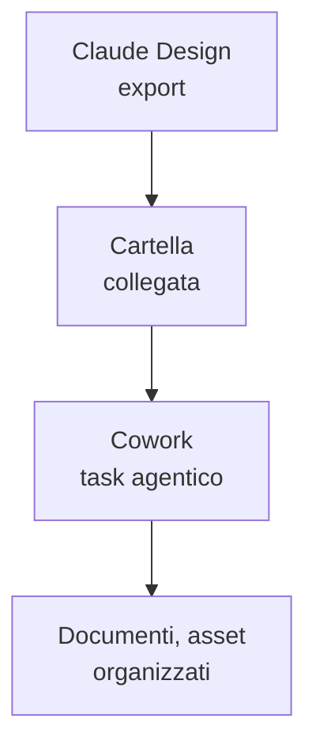

# Capitolo L4.4 — Design dentro Cowork

> Livello 4 — Design.
> Concetti di composizione tra prodotti; dettagli verificati il 24/06/2026.

## Obiettivo

Al termine saprai usare ciò che produci in Claude Design come **materiale** per i
task agentici di Cowork, e capirai come le Skills rendono il lavoro visuale
ripetibile invece di doverlo rispiegare ogni volta. È un capitolo di
composizione: non un nuovo strumento, ma due che già conosci messi a lavorare
insieme.

## Prerequisiti

- Saper avviare un task in Cowork (cap. L3.1).
- Aver prodotto qualcosa in Design (cap. L4.1) ed esportato un output (cap. L4.5).

## Design produce, Cowork lavora (EVERGREEN)

Design e Cowork rispondono a bisogni diversi. Design **crea** materiale visuale:
schermate, prototipi, slide, codice di un prototipo. Cowork **agisce** su una
cartella di file in più passi. Il punto di contatto è naturale: gli output di
Design diventano gli **input** di Cowork.

Il collegamento passa dalla cartella. Esporti da Design (per esempio uno ZIP, un
HTML standalone o il codice di un prototipo, vedi cap. L4.5), lo metti in una
cartella collegata a Cowork, e da lì Cowork ci lavora: riorganizza gli asset,
genera la documentazione, prepara i file per la consegna. Ricorda che Cowork vede
**solo le cartelle che colleghi** (cap. L3.1): l'asset esiste per lui solo dopo
che l'hai messo lì.

*Figura L4.4.1 — Dagli output di Design ai task di Cowork.*
Alt-text: diagramma verticale dall'export di Design alla cartella collegata fino
al task agentico di Cowork.

## Le Skills rendono il design ripetibile (EVERGREEN)

Il vero salto di qualità non è spostare un file: è rendere **ripetibile** il modo
in cui il lavoro visuale viene trattato. Qui entrano le Skills (Livello 5): una
skill scrive una volta le regole — come nominare gli asset, quale struttura di
cartelle usare, quali controlli fare su un export — e Claude le applica allo
stesso modo in chat, in Cowork e in Code.

Senza skill, ripeti le istruzioni a ogni task ("metti gli asset in `/img`,
rinomina così, genera l'indice"). Con una skill, le dici una volta e valgono
sempre. È la differenza tra un risultato che dipende da quanto sei stato preciso
oggi e un risultato costante.

## Un esempio concreto (EVERGREEN)

Immagina di produrre in Design i mockup di una nuova sezione del sito e di
esportarli come HTML standalone. Il flusso composto:

1. Esporti i mockup da Design in una cartella di progetto.
2. Colleghi la cartella a Cowork.
3. Dai a Cowork un task come **end-state** (cap. L3.1): «Organizza questi mockup
   per pagina, genera un `INDICE.md` con anteprime e note, e prepara una cartella
   `consegna/` pronta da inviare».
4. Una skill di progetto garantisce che nomi, struttura e controlli siano sempre
   gli stessi, mockup dopo mockup.

Il risultato: Design fa la parte creativa, Cowork la parte ripetitiva e
organizzativa, e la skill tiene insieme le regole.

## In pratica: comporre Design e Cowork

1. In Design, esporta l'output che ti serve (cap. L4.5) in una cartella.
2. In Cowork, **collega** quella cartella.
3. Scrivi il task come risultato voluto, non come sequenza di passi.
4. Se ripeti lo stesso tipo di lavoro, racchiudi le regole in una **skill** di
   progetto (Livello 5).
5. Rilancia su nuovi asset: la skill mantiene la coerenza.

## Errori comuni

- **Aspettarsi un collegamento automatico.** Design non "entra" in Cowork da
  solo: passi per un export e una cartella collegata.
- **Dimenticare di collegare la cartella.** Cowork vede solo ciò che colleghi: se
  l'asset non è lì, per lui non esiste (cap. L3.1).
- **Ripetere le regole a ogni task.** Se il lavoro ricorre, mettilo in una skill
  invece di rispiegarlo.
- **Guidare Cowork passo per passo.** Vale anche qui: descrivi l'end-state.

## Riepilogo

1. Design **crea** materiale visuale; Cowork **agisce** sui file: gli output del
   primo sono input del secondo.
2. Il collegamento passa da un **export** in una **cartella collegata** a Cowork.
3. Le **Skills** rendono ripetibile il trattamento del lavoro visuale, uguale in
   chat, Cowork e Code.
4. Schema tipico: Design crea, Cowork organizza, la skill tiene le regole.
5. In Cowork descrivi sempre il **risultato**, non i passi.

## Prossimo passo

Nel **cap. L4.5 — Export e Canva** chiudiamo il Livello 4 con i formati di uscita
di Design — PDF, PPTX, HTML, Canva e gli altri — e con il criterio per scegliere
tra esportare e fare handoff.

---

*Capitolo di composizione tra Design (cap. L4.1, L4.5) e Cowork (cap. L3.1). Le
capacità delle Skills sono introdotte qui e approfondite al Livello 5. Nessun
comando eseguito in questa sede.*
