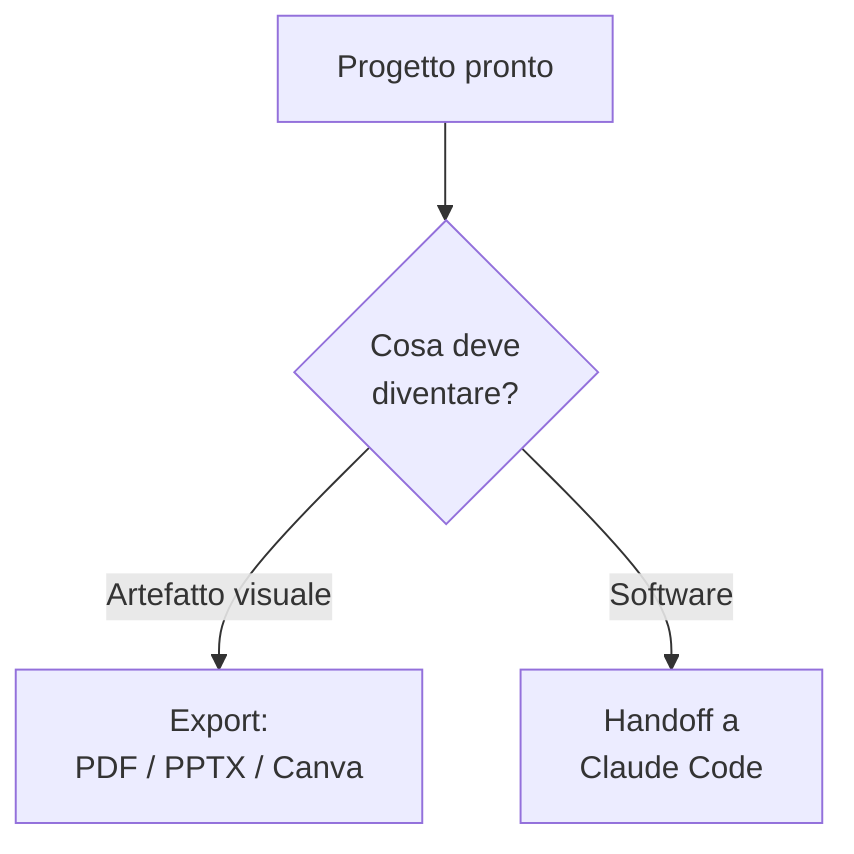

# Capitolo L4.5 — Export e Canva

> Livello 4 — Design.
> Dati di prodotto verificati il 24/06/2026 su fonti ufficiali.

## Obiettivo

Al termine saprai esportare un progetto di Claude Design nel formato giusto,
mandarlo agli strumenti che già usi (Canva e altri), e scegliere con criterio tra
**esportare** un file e fare **handoff** verso il codice. È il capitolo che porta
il lavoro fuori dal canvas.

## Prerequisiti

- Un progetto pronto sul canvas (cap. L4.1).
- Per l'handoff, Claude Code installato (cap. L2.2) e il concetto di ponte
  Design↔Code (cap. L4.3).

## Dove sta l'export (VOLATILE)

Quando il design è pronto, il pulsante **Export** in alto a destra apre le vie di
uscita. La scelta del formato dipende da cosa devi farne: raccogliere un parere,
consegnare allo sviluppo, o presentare a un gruppo.

## I formati di uscita (VOLATILE)

Le destinazioni si raggruppano per scopo. La tabella riassume le principali.

Tabella L4.5.1 — Formati di export e quando usarli.

| Scopo | Formato | Quando |
|---|---|---|
| Rivedere | PDF | feedback, stampa |
| Presentare | PPTX / Canva | slide da rifinire |
| Pubblicare | HTML / ZIP | prototipo, web |

Oltre a questi, Design esporta come **.zip**, manda **a Canva** e produce **HTML
standalone**. Può inoltre inviare il progetto a strumenti esterni — Adobe,
Base44, Canva, Gamma, Lovable, Miro, Replit, Vercel, Wix — con altre destinazioni
in arrivo. Per la condivisione interna all'organizzazione c'è un **link**
con permessi a tre livelli: sola visione, commento, modifica.

## Canva e gli strumenti esterni (VOLATILE)

"Send to Canva" porta il design dentro Canva, dove lo rifinisci con strumenti di
impaginazione che già conosci. La stessa logica vale per le altre destinazioni:
Design non vuole sostituire i tuoi strumenti, ma **consegnare** loro un punto di
partenza già impostato sul tuo brand, invece di farti ricominciare da una pagina
bianca.

## Esportare o fare handoff? (EVERGREEN)

È la scelta che conta di più, e dipende dalla destinazione del lavoro.

- **Esporta** quando l'output è il fine: un PDF per un parere, un PPTX da
  presentare, un file Canva da rifinire. Il design resta un artefatto visuale.
- **Fai handoff** quando il design deve diventare **software**. L'handoff a
  Claude Code (cap. L4.3) continua dal lavoro reale, senza ricostruire da uno
  screenshot, e punta al coding agent locale o a Claude Code Web.

Regola pratica: se la prossima persona a toccarlo apre un visualizzatore,
esporta; se apre un editor di codice, fai handoff.

*Figura L4.5.1 — Esportare o fare handoff: il bivio.*
Alt-text: diagramma verticale che dal progetto pronto separa il ramo export dal
ramo handoff verso il codice.

## In pratica: porta fuori il tuo design

1. Apri il progetto e premi **Export** in alto a destra.
2. Per un parere: **PDF**. Per presentare: **PPTX** o **Send to Canva**.
3. Per un prototipo web: **HTML standalone** o **.zip**.
4. Se deve diventare software, scegli **Handoff a Claude Code** invece di un file.
5. Per condividere nel team, genera un **link** con il permesso giusto (visione,
   commento o modifica).

## Errori comuni

- **Esportare uno screenshot per lo sviluppo.** Se diventa codice, fai handoff:
  porti il lavoro reale, non una foto.
- **Formato sbagliato per lo scopo.** PDF per un parere, PPTX/Canva per
  presentare, HTML/ZIP per il web.
- **Link con permesso troppo ampio.** Per un semplice parere basta "sola
  visione" o "commento", non "modifica".
- **Cercare destinazioni che non ci sono ancora.** L'elenco cresce nel tempo:
  verifica quali sono disponibili al momento. (VOLATILE)

## Riepilogo

1. Il pulsante **Export** (in alto a destra) apre le vie di uscita di Design.
2. Formati: **PDF, PPTX, HTML, .zip**, invio a **Canva** e ad altri strumenti.
3. **Send to Canva** e simili consegnano un punto di partenza già sul brand.
4. **Esporta** per un artefatto visuale; **handoff** quando deve diventare
   software.
5. Condividi nell'org con un **link** a permessi: visione, commento, modifica.

## Prossimo passo

Hai completato il Livello 4. Nel **Livello 5 — Skills e identità** vediamo cosa
sono davvero le Skills — già incontrate come collante di Cowork e Design — a
partire dal **cap. L5.1 — Anatomia di una skill**.

---

*Dati su export, destinazioni e condivisione verificati il 24/06/2026 su
support.claude.com/en/articles/14604416. Le funzioni richiedono un account a
pagamento, quindi non sono state eseguite in questa sede.*
