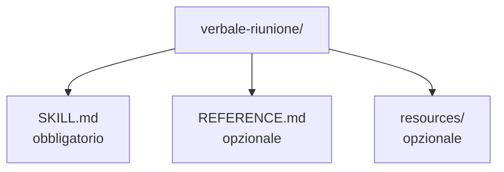

# Capitolo L5.2 — La tua prima skill

> Livello 5 — Skills e identità.
> Dati di prodotto verificati il 24/06/2026 su fonti ufficiali.

## Obiettivo

Al termine avrai creato una skill funzionante: la struttura della cartella, una
`description` che "scatta" quando deve, e il modo di testarla. Vedremo sia la via
manuale sia l'aiuto di **skill-creator**, la skill che assiste a costruirne altre.

## Prerequisiti

- Capire l'anatomia di una skill (cap. L5.1).
- **Code execution** attiva (cap. L1.3). (VOLATILE)

## La struttura della cartella (VOLATILE)

Una skill è una cartella il cui nome coincide con il nome della skill, con dentro
almeno il file `SKILL.md`. Se aggiungi risorse o script, stanno nella stessa
cartella.

*Figura L5.2.1 — Struttura di una cartella skill.*
Alt-text: diagramma verticale della cartella skill con SKILL.md e una sottocartella
di risorse.

Per usarla in chat o in Cowork, la cartella va compressa in uno **ZIP** con la
cartella stessa come radice (non i file sciolti nello ZIP), e poi caricata. In
Claude Code, invece, la metti sotto `.claude/skills/` del progetto (cap. L2.4).

## Scrivere una description che scatta (EVERGREEN)

È il passo che decide tutto. La `description` deve dire **cosa** fa la skill e
**quando** Claude deve usarla, in massimo 200 caratteri. Due esempi a confronto:

- **Debole:** "Aiuta con le email." — troppo generica, scatta a caso o mai.
- **Forte:** "Scrive risposte email cortesi e brevi a clienti, a partire dal
  messaggio ricevuto." — dice il compito e il contesto d'uso.

La regola: includi i segnali che vuoi facciano scattare la skill. Se deve attivarsi
sui verbali, nomina i verbali; se sui clienti, nomina i clienti.

## Costruirla con skill-creator (VOLATILE)

Non sei costretto a partire dal foglio bianco. **skill-creator** è una skill
ufficiale che ti guida a crearne una: imposta la struttura, ti aiuta a scrivere la
description e può generare prompt di prova (eval) per controllare che la skill
scatti quando deve — e, importante, che **non** scatti quando non deve.

È il modo più rapido per una prima skill solida: descrivi il workflow che vuoi
automatizzare, e skill-creator produce lo scheletro che poi rifinisci.

## Testare prima e dopo l'upload (EVERGREEN)

Una skill si valuta sul campo. Prima di caricarla, rileggi il `SKILL.md`,
controlla che la description rifletta davvero quando serve, e verifica che i file
richiamati esistano. Dopo averla caricata e abilitata in **Customize > Skills**,
provala con più prompt che dovrebbero attivarla, e controlla nel "thinking" di
Claude che la stia caricando. Se non scatta quando te lo aspetti, il punto da
correggere è quasi sempre la **description**.

## In pratica: crea e prova una skill

1. Crea una cartella con il nome della skill (es. `verbale-riunione`).
2. Dentro, scrivi `SKILL.md` con frontmatter (name, description) e corpo.
3. Cura la **description**: cosa fa e quando usarla, sotto i 200 caratteri.
4. Per la chat/Cowork, comprimi la cartella in **ZIP** (cartella come radice) e
   caricala; abilitala in **Customize > Skills**.
5. Prova con prompt che devono attivarla; controlla che si carichi.
6. Se non scatta, **itera sulla description** e riprova.

## Errori comuni

- **ZIP con i file sciolti.** Lo ZIP deve contenere la **cartella** come radice,
  non i file direttamente. (VOLATILE)
- **Nome cartella diverso dal nome skill.** Falli coincidere.
- **Description che non scatta.** Aggiungi i segnali del "quando"; non descrivere
  solo il "cosa".
- **Provarla una volta sola.** Testa con più prompt, inclusi alcuni che **non**
  devono attivarla.
- **Hardcodare segreti.** Mai chiavi o password dentro una skill. (EVERGREEN)

## Riepilogo

1. Una skill è una **cartella** (nome = nome skill) con dentro `SKILL.md`.
2. Per chat/Cowork si carica come **ZIP** con la cartella come radice; in Code va
   in `.claude/skills/`.
3. La **description** che scatta nomina cosa fa **e** quando usarla.
4. **skill-creator** scaffolda la skill e genera prove di attivazione.
5. Testa prima e dopo l'upload; se non scatta, itera sulla description.

## Prossimo passo

Nel **cap. L5.3 — Skills operative in Cowork** vediamo le Skills al lavoro nei
task autonomi: differenze tra chat e Cowork, come spezzarle, e la condivisione in
team. Useremo come esempio le tre skill con cui è scritto questo libro.

---

*Dati su struttura, packaging ZIP, test e skill-creator verificati il 24/06/2026
su support.claude.com/en/articles/12512198. Nessuna skill è stata creata o
eseguita in questa sede.*
