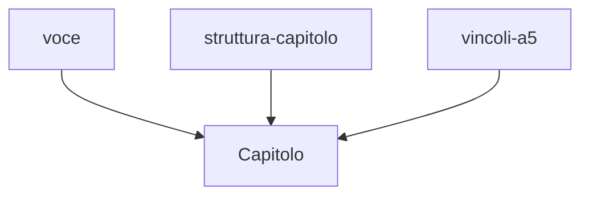

# Capitolo L5.3 — Skills operative in Cowork

> Livello 5 — Skills e identità.
> Dati di prodotto verificati il 24/06/2026 su fonti ufficiali.

## Obiettivo

Al termine saprai usare le Skills nel lavoro autonomo: come si comportano in chat
rispetto a Cowork, perché conviene spezzarle in più skill focalizzate invece di
una sola grande, e come condividerle in team. L'esempio guida sono le tre skill
con cui è scritto questo libro.

## Prerequisiti

- Saper creare una skill (cap. L5.2).
- Conoscere Cowork (cap. L3.1).

## In chat e in Cowork (EVERGREEN)

Una stessa skill vale in chat, in Cowork e in Claude Code: la scrivi una volta e
guida Claude allo stesso modo ovunque. Cambia il contesto in cui lavora.

In **chat** la skill rifinisce una singola risposta: tono, formato, struttura. In
**Cowork**, dove Claude esegue un task lungo su una cartella in più passi, la
skill conta di più: governa un comportamento ripetuto su molti file, senza che tu
debba ripetere le regole a ogni passaggio. Più il lavoro è autonomo e lungo, più
una skill ben scritta fa la differenza tra un risultato costante e uno che dipende
da quanto sei stato preciso oggi.

## Spezzare invece di accumulare (EVERGREEN)

La tentazione è scrivere una skill che fa tutto. È quasi sempre un errore. Più
skill **focalizzate** compongono meglio di una monolitica, per due ragioni: la
`description` di una skill mirata scatta con precisione (cap. L5.1), mentre quella
di una skill tuttofare è per forza vaga; e Claude può **combinare** più skill in
automatico quando servono insieme.

Regola pratica: una skill, un workflow. Se ti accorgi che una skill ha due scopi
distinti, dividila. Le skill non possono richiamarsi a vicenda, ma Claude ne usa
diverse nello stesso task: la composizione la fa lui.

## Esempio: le tre skill di questo libro (EVERGREEN)

Questo manuale è scritto con tre skill separate invece di un'unica grande:

- **voce** — tono e terminologia: italiano pratico, termini di prodotto in
  inglese, niente entusiasmo da brochure.
- **struttura-capitolo** — struttura standard, target di lunghezza, uso del
  ledger dei fatti, definition of done.
- **vincoli-a5** — vincoli di impaginazione: codice stretto, tabelle a tre
  colonne, diagrammi verticali.

Ognuna ha uno scopo netto e una description che scatta sul suo ambito. Quando
scrivo un capitolo, Claude le usa **tutte e tre insieme**: la voce regola il
testo, la struttura l'ossatura, i vincoli la forma. Una sola skill che facesse il
lavoro di tutte e tre sarebbe più difficile da scrivere, da far scattare e da
aggiornare.

*Figura L5.3.1 — Tre skill focalizzate che Claude compone su un capitolo.*
Alt-text: diagramma verticale con tre skill che convergono sulla scrittura di un
capitolo.

## Condividere in team (VOLATILE)

Una skill utile non deve restare sul tuo account. Sui piani **Team ed Enterprise**
un amministratore può fornire e gestire le skill per tutta l'organizzazione, così
tutti lavorano con le stesse regole. È il modo per rendere uno standard — di voce,
di formato, di processo — qualcosa che vale per il gruppo e non solo per chi l'ha
scritto. (VOLATILE)

> **Tip:** prima di condividere una skill in team, falla provare a qualcun altro
> su prompt reali. Una description che scatta bene per te può scattare male per
> chi usa parole diverse.

## In pratica: porta le tue skill in Cowork

1. Parti da un workflow che ripeti spesso in Cowork (es. organizzare asset,
   produrre un report).
2. Scrivine le regole in una skill **focalizzata** (cap. L5.2).
3. Se gli scopi sono due, fai **due** skill, non una.
4. Attivala e lancia un task in Cowork: verifica che le regole siano applicate.
5. Se sei in un team, chiedi all'admin di renderla disponibile all'organizzazione.

## Errori comuni

- **La skill tuttofare.** Description vaga e difficile da mantenere. Spezza per
  workflow.
- **Aspettarsi che una skill ne richiami un'altra.** Non succede: è Claude a
  comporle. Scrivile autonome.
- **Condividere senza far provare.** In team, una description va testata su più
  modi di scrivere lo stesso intento.
- **Ripetere le regole nel prompt.** Se sono in una skill, non serve ridirle a
  ogni task.

## Riepilogo

1. La stessa skill vale in chat, Cowork e Code; in Cowork pesa di più perché
   governa task lunghi e autonomi.
2. Più skill **focalizzate** compongono meglio di una monolitica.
3. Le skill non si richiamano tra loro: la **composizione** la fa Claude.
4. Le tre skill di questo libro (voce, struttura, vincoli) sono l'esempio del
   pattern.
5. In **Team/Enterprise** un admin condivide le skill con tutta l'organizzazione.

## Prossimo passo

Nel **cap. L5.4 — Far suonare Claude come te** mettiamo insieme tutti gli
strumenti dell'identità — istruzioni, Projects, file di contesto e Skills — per
dare a Claude la tua voce in modo stabile.

---

*Dati su uso, composizione e condivisione delle skill verificati il 24/06/2026 su
support.claude.com/en/articles/12512198. L'esempio delle tre skill è reale (sono
quelle del progetto di questo libro). Nessuna skill eseguita in questa sede.*
