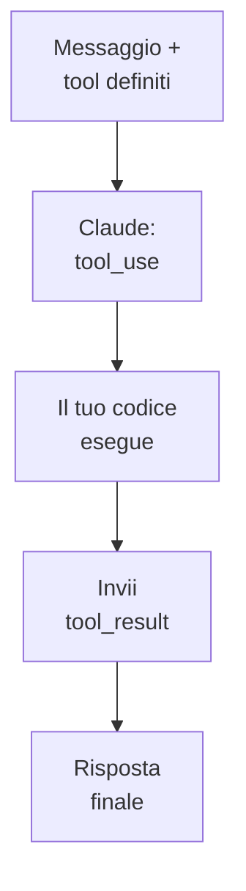

# Capitolo L6.6 — Integrare via API

> Livello 6 — Avanzato.
> Dati di prodotto verificati il 24/06/2026 su fonti ufficiali.

## Obiettivo

Al termine saprai quando passare alle API, com'è fatta una chiamata all'endpoint
dei messaggi, e come funziona il **tool use** (l'uso degli strumenti). È il ponte
da chi *usa* Claude a chi lo *integra* nei propri software.

## Prerequisiti

- Una API key dalla Console (cap. L2.3, F.3). (VOLATILE)
- Dimestichezza con un linguaggio di programmazione.

## Quando servono le API (EVERGREEN)

Le interfacce (chat, Cowork, Code) bastano per il lavoro personale. Le **API**
servono quando vuoi mettere Claude **dentro** un tuo prodotto: un'app che risponde
ai clienti, un processo che classifica documenti, un servizio che genera testo su
richiesta. È accesso programmatico, pay-as-you-go a token (cap. F.3).

## L'endpoint dei messaggi (VOLATILE)

Il cuore delle API è un endpoint: invii una lista di messaggi, Claude genera il
successivo. La chiamata grezza, con `curl`:

```bash
curl https://api.anthropic.com/v1/messages \
  -H "x-api-key: $ANTHROPIC_API_KEY" \
  -H "anthropic-version: 2023-06-01" \
  -H "content-type: application/json" \
  -d '{
    "model": "claude-opus-4-8",
    "max_tokens": 1024,
    "messages": [
      {"role": "user",
       "content": "Ciao"}
    ]
  }'
```

Tre header sono obbligatori: `x-api-key` (la tua chiave), `anthropic-version` (es.
`2023-06-01`) e `content-type`. Il corpo dichiara almeno `model`, `max_tokens` e
`messages`. (VOLATILE: la stringa del modello cambia, vedi il ledger.)

## Con l'SDK (VOLATILE)

In pratica non si usa `curl`, ma un SDK ufficiale (Python o TypeScript), che
gestisce header e formati. In Python:

```python
import anthropic

# Reads the key from ANTHROPIC_API_KEY
client = anthropic.Anthropic()

msg = client.messages.create(
    model="claude-opus-4-8",
    max_tokens=1024,
    messages=[
        {"role": "user",
         "content": "Ciao, chi sei?"},
    ],
)
print(msg.content[0].text)
```

## Tool use, in breve (EVERGREEN)

Il **tool use** permette a Claude di usare strumenti che fornisci tu — una
funzione che interroga un database, chiama un'API, fa un calcolo. Il flusso è un
botta e risposta in tre tempi:

1. Definisci i tool nella richiesta e mandi il messaggio.
2. Se serve uno strumento, Claude risponde con `stop_reason: "tool_use"` e un
   blocco che dice **quale** tool e con **quali** argomenti.
3. Il tuo codice esegue l'operazione e rimanda il risultato come `tool_result`;
   Claude lo usa per la risposta finale.

*Figura L6.6.1 — Il ciclo del tool use.*
Alt-text: diagramma verticale dal messaggio alla richiesta di tool, all'esecuzione
nel tuo codice, al risultato, alla risposta finale.



Il punto chiave: lo strumento **lo esegui tu**, nel tuo software. Claude decide
quando usarlo e con quali argomenti, ma il codice resta sotto il tuo controllo.

## In pratica: la tua prima chiamata

1. Genera una **API key** nella Console e impostala come variabile d'ambiente
   (cap. L2.3).
2. Installa l'SDK del tuo linguaggio (Python o TypeScript).
3. Fai una chiamata minima all'endpoint dei messaggi e leggi la risposta.
4. Per integrare azioni, definisci un **tool** e gestisci il ciclo `tool_use` →
   `tool_result`.
5. Tieni la chiave fuori dal codice: usa variabili d'ambiente (cap. L2.3).

## Errori comuni

- **Header mancanti.** Servono `x-api-key`, `anthropic-version` e `content-type`.
  (VOLATILE)
- **Stringa del modello fissata.** Cambia nel tempo: prendila dal ledger o dalle
  fonti ufficiali.
- **Chiave nel codice.** Mai: usa una variabile d'ambiente (cap. L2.3).
- **Aspettarsi che Claude esegua il tool.** Lo esegui tu; Claude decide quando e
  come chiamarlo.

## Riepilogo

1. Le API servono a integrare Claude **dentro** i tuoi software; pay-as-you-go.
2. Endpoint `POST /v1/messages` con header `x-api-key`, `anthropic-version`,
   `content-type`.
3. In pratica usi un **SDK** (Python/TS), non `curl`.
4. Il **tool use** è un ciclo: Claude chiede un tool, il tuo codice lo esegue e
   rimanda il risultato.
5. La chiave sta in una **variabile d'ambiente**, mai nel codice.

## Prossimo passo

Hai completato il Livello 6. Nella **Chiusura**, il **cap. C.1 — Progetto
end-to-end** attraversa tutti i livelli su un caso reale, dal design al codice
fino all'automazione.

---

*Dati su endpoint, header e tool use verificati il 24/06/2026 su
platform.claude.com/docs (messages, tool use). Gli esempi non sono stati eseguiti
in questa sede; richiedono una API key valida.*
